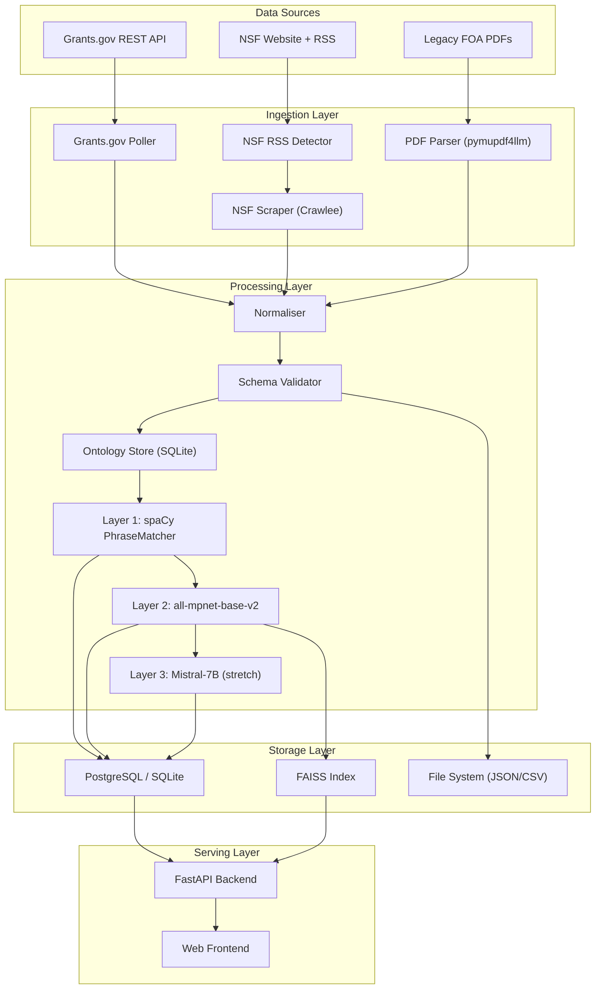
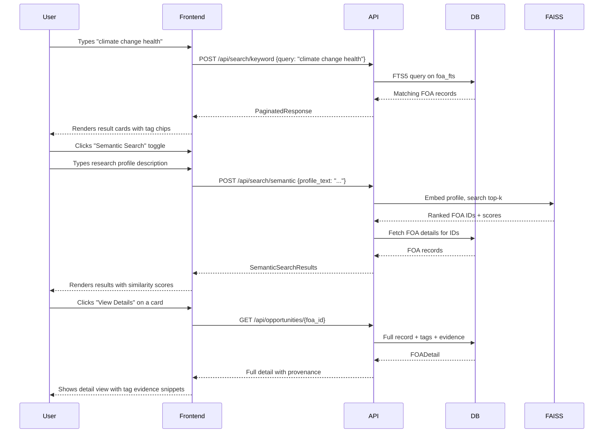

# ISSR AI-Powered Funding Intelligence — Complete Implementation Blueprint

> **Scope**: This document is the single source of truth for building the complete ISSR Funding Intelligence platform. It maps every deliverable from the GSoC 2026 proposal to concrete code, ties the backend pipeline to a web-facing search interface (the institution's end goal — "a simpler Grants.gov"), and gives you a file-by-file, function-by-function execution plan.

---

## Table of Contents

1. [Vision & System Overview](#1-vision--system-overview)
2. [Current State Audit](#2-current-state-audit)
3. [Complete Directory Structure](#3-complete-directory-structure)
4. [Data Models & Schemas](#4-data-models--schemas)
5. [Module 1 — Hybrid Ingestion Engine](#5-module-1--hybrid-ingestion-engine)
6. [Module 2 — Layout-Aware PDF Parsing](#6-module-2--layout-aware-pdf-parsing)
7. [Module 3 — Schema Normalisation & Validation](#7-module-3--schema-normalisation--validation)
8. [Module 4 — Ontology Store & Synonym Expansion](#8-module-4--ontology-store--synonym-expansion)
9. [Module 5 — Semantic Tagging Engine (Layer 1 + Layer 2 + Layer 3)](#9-module-5--semantic-tagging-engine)
10. [Module 6 — Vector Search & Grant Matching](#10-module-6--vector-search--grant-matching)
11. [Module 7 — FastAPI Backend (REST API)](#11-module-7--fastapi-backend-rest-api)
12. [Module 8 — Web Frontend ("Simpler Grants.gov")](#12-module-8--web-frontend-simpler-grantsgov)
13. [Module 9 — Export & Reporting](#13-module-9--export--reporting)
14. [Module 10 — Dockerisation & Deployment](#14-module-10--dockerisation--deployment)
15. [Testing Strategy](#15-testing-strategy)
16. [Configuration Reference](#16-configuration-reference)
17. [Week-by-Week Execution Checklist](#17-week-by-week-execution-checklist)
18. [Risk Register & Fallback Matrix](#18-risk-register--fallback-matrix)
19. [Post-GSoC Roadmap](#19-post-gsoc-roadmap)

---

## 1. Vision & System Overview

### 1.1 The Problem
Research development officers at ISSR (University of Alabama) currently discover funding opportunities through a fragmented manual process: browsing Grants.gov, checking NSF pages, reading PDFs, and cross-referencing with institutional research profiles. This is reactive, slow, and misses opportunities.

### 1.2 The Solution
An automated pipeline that:
1. **Ingests** FOAs from Grants.gov API + NSF web scraping
2. **Parses** complex multi-column PDFs preserving reading order
3. **Normalises** all records into a unified JSON schema
4. **Tags** every FOA with semantic labels (GREAT Act categories, UN SDGs, research domains, methods, populations)
5. **Indexes** embeddings for semantic search
6. **Serves** everything through a clean web interface — a "Simpler Grants.gov" tailored for ISSR

### 1.3 Architecture Diagram



### 1.4 How This Aligns with the GSoC Proposal

| GSoC Proposal Phase | What It Delivers | Blueprint Module(s) |
|---|---|---|
| Phase 0: Community Bonding | Architecture, ontology setup | Modules 4, Config |
| Phase 1: Weeks 1-3 | Ingestion + PDF parsing | Modules 1, 2 |
| Phase 2: Weeks 4-6 | Normalisation + Layer 1 tagging | Modules 3, 4, 5 (Layer 1) |
| Phase 3: Weeks 7-8 | Embedding layer + integration | Module 5 (Layer 2+3), 6 |
| Phase 4: Week 9 | Evaluation + matching foundation | Module 6, 9 |
| Phase 5: Weeks 10-12 | Testing, refinement, Docker | Module 10, 15 |
| Phase 6: Week 13 | Final report + handoff | Documentation |
| **ISSR End Goal** | **Web interface** | **Modules 7, 8** |

> [!IMPORTANT]
> Modules 7 (FastAPI) and 8 (Web Frontend) are the **institution's end goal** beyond the GSoC scope. The pipeline modules (1-6) are designed from Day 1 to feed into this web layer. Build the backend API alongside the pipeline — don't bolt it on later.

---

## 2. Current State Audit

### 2.1 What Exists in `funding-intelligence/`

| File | Status | Notes |
|---|---|---|
| [grants_gov.py](file:///Users/pratikpawar/funding-intelligence/src/foa_pipeline/grants_gov.py) | ✅ Working | `GrantsGovClient` with retry, pagination, dedup. Covers Phase 1 Week 1. |
| [nsf_rss.py](file:///Users/pratikpawar/funding-intelligence/src/foa_pipeline/nsf_rss.py) | ✅ Working | RSS feed polling → SQLite queue. Covers Phase 1 Week 1. |
| [schema.py](file:///Users/pratikpawar/funding-intelligence/src/foa_pipeline/schema.py) | ⚠️ Minimal | `build_raw_record()` creates basic records. Needs full FOA schema expansion. |
| [config.py](file:///Users/pratikpawar/funding-intelligence/src/foa_pipeline/config.py) | ✅ Working | Env-based config dataclass. Needs expansion for new modules. |
| [storage.py](file:///Users/pratikpawar/funding-intelligence/src/foa_pipeline/storage.py) | ✅ Working | JSONL read/write + dedup. Keep as-is. |
| [cli.py](file:///Users/pratikpawar/funding-intelligence/src/foa_pipeline/cli.py) | ✅ Working | Argparse CLI. Will grow with new subcommands. |
| [logging_setup.py](file:///Users/pratikpawar/funding-intelligence/src/foa_pipeline/logging_setup.py) | ✅ Working | Basic logging config. |

### 2.2 What Exists in the FOA Screening Task (`PratikPawar1401/FOA`)

The screening task repository contains your earlier exploration work with:
- Grants.gov API interaction prototypes
- Initial data models and response handling
- Test cases for API pagination

**Key patterns to carry forward:**
- The `oppHits` / `opportunities` response field handling (already in `grants_gov.py`)
- Exponential backoff retry logic (already in `grants_gov.py`)
- SQLite queue pattern for pending URLs (already in `nsf_rss.py`)

### 2.3 What Needs to Be Built

| Priority | Module | Complexity | Depends On |
|---|---|---|---|
| 🔴 P0 | NSF Web Scraper | Medium | nsf_rss.py (queue draining) |
| 🔴 P0 | PDF Parser | Medium | None |
| 🔴 P0 | Full Schema + Validator | Low | None |
| 🔴 P0 | Ontology Store | Medium | None |
| 🔴 P0 | Layer 1 Tagger (spaCy) | High | Ontology Store |
| 🔴 P0 | Layer 2 Tagger (Embeddings) | High | Layer 1 |
| 🟡 P1 | FastAPI Backend | Medium | Schema, DB |
| 🟡 P1 | Database Layer (SQLite/Postgres) | Medium | Schema |
| 🟡 P1 | Web Frontend | High | FastAPI Backend |
| 🟢 P2 | FAISS Vector Index | Medium | Layer 2 Embeddings |
| 🟢 P2 | Layer 3 (Mistral-7B) | Low | Layer 2 |
| 🟢 P2 | CSV/Report Export | Low | Schema |

---

## 3. Complete Directory Structure

```
funding-intelligence/
├── .env.example                        # All configurable parameters
├── .env                                # Local overrides (gitignored)
├── .gitignore
├── docker-compose.yml                  # Full stack orchestration
├── Dockerfile                          # Python 3.11-slim base
├── Makefile                            # Developer convenience commands
├── README.md                           # Quickstart + schema reference
├── MATCHING.md                         # Grant-matching integration guide
├── CHANGELOG.md                        # Release notes
├── requirements.txt                    # Production dependencies (pinned)
├── requirements-dev.txt                # Test + lint dependencies
├── pyproject.toml                      # Project metadata & tool config
│
├── Documentation/
│   ├── ISSR_AI_Powered_Funding_Intelligence_GSoC2026_Pratik_Pawar_draft_01.md
│   ├── architecture_diagram.png        # [GENERATE] System architecture
│   ├── evaluation_report.md            # Phase 4-5 P/R/F1 metrics
│   └── api_reference.md               # FastAPI auto-generated docs ref
│
├── data/
│   ├── raw/                            # Ingested JSONL (gitignored)
│   │   ├── grants_gov.jsonl
│   │   └── nsf_scraped.jsonl
│   ├── normalised/                     # Validated + normalised JSON + CSV
│   │   ├── foa_normalised.jsonl
│   │   └── foa_normalised.csv
│   ├── queues/                         # SQLite queue DBs (gitignored)
│   │   └── nsf_queue.db
│   ├── ontology/                       # Ontology source files
│   │   ├── great_act_categories.csv    # GREAT Act mission labels
│   │   ├── un_sdg_goals.csv            # UN SDG goals + targets
│   │   ├── research_methods.csv        # Method/approach vocabulary
│   │   ├── populations.csv             # Target population vocabulary
│   │   └── synonyms_wordnet.json       # Pre-computed synonym expansions
│   ├── embeddings/                     # Cached embeddings
│   │   ├── ontology_embeddings.npy     # Pre-computed ontology concept vectors
│   │   ├── ontology_labels.json        # Label-to-index mapping
│   │   └── foa_embeddings.npy          # All FOA embeddings (export)
│   ├── evaluation/                     # Hand-labelled evaluation set
│   │   ├── eval_set_50.json            # 30-50 FOAs with ground truth tags
│   │   └── eval_results.json           # P/R/F1 per category
│   └── db/                             # Application database
│       └── funding_intelligence.db     # SQLite main DB (dev)
│
├── scraper_config/                     # Per-domain scraping rules
│   ├── nsf.yaml                        # NSF scraping selectors + rules
│   └── grants_gov.yaml                 # Grants.gov-specific config
│
├── prompts/                            # LLM prompt templates (stretch)
│   └── disambiguation.txt              # Mistral-7B prompt template
│
├── src/
│   └── foa_pipeline/
│       ├── __init__.py
│       ├── cli.py                      # [EXTEND] Main CLI entry point
│       ├── config.py                   # [EXTEND] All configuration
│       ├── logging_setup.py            # Logging configuration
│       │
│       ├── # ── INGESTION ──
│       ├── grants_gov.py               # [EXISTS] Grants.gov API client
│       ├── nsf_rss.py                  # [EXISTS] NSF RSS change detector
│       ├── nsf_scraper.py              # [NEW] Crawlee + Playwright scraper
│       │
│       ├── # ── PARSING ──
│       ├── pdf_parser.py               # [NEW] pymupdf4llm + pdfplumber
│       │
│       ├── # ── NORMALISATION ──
│       ├── schema.py                   # [EXTEND] Full FOA schema
│       ├── normaliser.py               # [NEW] Date/text normalisation
│       ├── validator.py                # [NEW] JSON Schema validation
│       │
│       ├── # ── ONTOLOGY ──
│       ├── ontology_store.py           # [NEW] SQLite ontology management
│       ├── synonym_expander.py         # [NEW] WordNet synonym expansion
│       │
│       ├── # ── TAGGING ──
│       ├── tagger_l1_spacy.py          # [NEW] spaCy PhraseMatcher
│       ├── tagger_l2_embedding.py      # [NEW] all-mpnet-base-v2 cosine
│       ├── tagger_l3_llm.py            # [NEW] Mistral-7B disambiguation
│       ├── tagger_pipeline.py          # [NEW] Orchestrates L1 → L2 → L3
│       ├── evidence_logger.py          # [NEW] Provenance metadata
│       │
│       ├── # ── VECTOR SEARCH ──
│       ├── vector_index.py             # [NEW] FAISS IndexFlatIP
│       ├── grant_matcher.py            # [NEW] Profile → FOA matching
│       │
│       ├── # ── STORAGE ──
│       ├── storage.py                  # [EXISTS] JSONL utilities
│       ├── database.py                 # [NEW] SQLite/Postgres abstraction
│       ├── models.py                   # [NEW] SQLAlchemy/dataclass models
│       │
│       ├── # ── EXPORT ──
│       ├── csv_exporter.py             # [NEW] Pandas CSV with tag_evidence
│       ├── evaluation.py               # [NEW] P/R/F1 metrics computation
│       │
│       └── # ── API ──
│           api/
│           ├── __init__.py
│           ├── app.py                  # [NEW] FastAPI application factory
│           ├── routes/
│           │   ├── __init__.py
│           │   ├── opportunities.py    # [NEW] CRUD + search endpoints
│           │   ├── search.py           # [NEW] Semantic search endpoint
│           │   ├── tags.py             # [NEW] Tag/ontology endpoints
│           │   ├── export.py           # [NEW] CSV/JSON download
│           │   └── health.py           # [NEW] Health check
│           ├── schemas.py              # [NEW] Pydantic request/response
│           ├── deps.py                 # [NEW] Dependency injection
│           └── middleware.py           # [NEW] CORS, logging, rate limit
│
├── frontend/                           # Web UI ("Simpler Grants.gov")
│   ├── index.html                      # Single-page app shell
│   ├── css/
│   │   └── styles.css                  # Design system
│   ├── js/
│   │   ├── app.js                      # Main application logic
│   │   ├── api.js                      # API client module
│   │   ├── components/
│   │   │   ├── search-bar.js           # Search input + filters
│   │   │   ├── results-list.js         # FOA results cards
│   │   │   ├── opportunity-detail.js   # Full FOA detail view
│   │   │   ├── filter-sidebar.js       # Faceted filter panel
│   │   │   ├── tag-chips.js            # Semantic tag display
│   │   │   ├── pagination.js           # Results pagination
│   │   │   └── stats-dashboard.js      # Summary statistics
│   │   └── utils/
│   │       ├── date-format.js          # Date utilities
│   │       └── debounce.js             # Input debounce
│   └── assets/
│       ├── favicon.svg
│       └── logo.svg
│
└── tests/
    ├── conftest.py                     # Shared fixtures
    ├── test_grants_gov_pagination.py   # [EXISTS]
    ├── test_nsf_rss_queue.py           # [EXISTS]
    ├── test_nsf_scraper.py             # [NEW]
    ├── test_pdf_parser.py              # [NEW]
    ├── test_normaliser.py              # [NEW]
    ├── test_validator.py               # [NEW]
    ├── test_ontology_store.py          # [NEW]
    ├── test_tagger_l1.py               # [NEW]
    ├── test_tagger_l2.py               # [NEW]
    ├── test_tagger_pipeline.py         # [NEW]
    ├── test_vector_index.py            # [NEW]
    ├── test_csv_exporter.py            # [NEW]
    ├── test_evaluation.py              # [NEW]
    ├── test_api_opportunities.py       # [NEW]
    ├── test_api_search.py              # [NEW]
    └── fixtures/
        ├── sample_foa.json             # Sample normalised FOA
        ├── sample_pdf/                 # Test PDFs (multi-column)
        │   ├── two_column_foa.pdf
        │   └── single_column_foa.pdf
        └── sample_grants_gov_response.json
```

---

## 4. Data Models & Schemas

### 4.1 Canonical FOA Record Schema (JSON Schema)

This is the heart of the system. Every data source normalises into this schema.

```json
{
  "$schema": "http://json-schema.org/draft-07/schema#",
  "$id": "https://issr.ua.edu/foa/schema/v1.0",
  "title": "ISSR FOA Record",
  "type": "object",
  "required": [
    "schema_version", "foa_id", "source", "source_id", "title",
    "ingestion_date", "status"
  ],
  "properties": {
    "schema_version": {
      "type": "string",
      "const": "1.0"
    },
    "foa_id": {
      "type": "string",
      "description": "Internal unique ID (UUID4)"
    },
    "source": {
      "type": "string",
      "enum": ["grants_gov", "nsf_scraper", "pdf_upload"]
    },
    "source_id": {
      "type": "string",
      "description": "Original ID from source system (OpportunityID, NSF solicitation number)"
    },
    "source_url": {
      "type": ["string", "null"],
      "format": "uri"
    },
    "title": {
      "type": "string",
      "minLength": 1
    },
    "agency": {
      "type": ["string", "null"],
      "description": "Funding agency name"
    },
    "agency_code": {
      "type": ["string", "null"],
      "description": "Agency code (e.g., 'NSF', 'HHS', 'DOE')"
    },
    "opportunity_number": {
      "type": ["string", "null"],
      "description": "Official FOA number"
    },
    "cfda_numbers": {
      "type": "array",
      "items": { "type": "string" },
      "description": "CFDA/Assistance Listing numbers"
    },
    "posted_date": {
      "type": ["string", "null"],
      "format": "date",
      "description": "ISO 8601 date"
    },
    "close_date": {
      "type": ["string", "null"],
      "format": "date",
      "description": "ISO 8601 date, null if rolling/continuous"
    },
    "archive_date": {
      "type": ["string", "null"],
      "format": "date"
    },
    "status": {
      "type": "string",
      "enum": ["open", "closed", "forecasted", "archived"]
    },
    "funding_instrument": {
      "type": ["string", "null"],
      "enum": ["grant", "cooperative_agreement", "procurement_contract", "other", null]
    },
    "award_floor": {
      "type": ["number", "null"],
      "minimum": 0,
      "description": "Minimum award amount in USD"
    },
    "award_ceiling": {
      "type": ["number", "null"],
      "minimum": 0,
      "description": "Maximum award amount in USD"
    },
    "expected_awards": {
      "type": ["integer", "null"],
      "minimum": 0
    },
    "estimated_funding": {
      "type": ["number", "null"],
      "minimum": 0,
      "description": "Total estimated program funding in USD"
    },
    "eligibility": {
      "type": "array",
      "items": { "type": "string" },
      "description": "Eligible applicant types"
    },
    "program_description": {
      "type": ["string", "null"],
      "description": "Full program description text"
    },
    "eligibility_description": {
      "type": ["string", "null"],
      "description": "Full eligibility description text"
    },
    "additional_info": {
      "type": ["string", "null"],
      "description": "Any supplementary info extracted from PDF or HTML"
    },
    "tags": {
      "type": "array",
      "items": {
        "type": "object",
        "required": ["tag_id", "label", "category", "source_layer", "confidence"],
        "properties": {
          "tag_id": { "type": "string" },
          "label": { "type": "string" },
          "category": {
            "type": "string",
            "enum": ["research_domain", "method", "population", "sponsor_theme"]
          },
          "source_layer": {
            "type": "string",
            "enum": ["layer_1_terminological", "layer_2_embedding", "layer_3_llm"]
          },
          "confidence": {
            "type": "number",
            "minimum": 0,
            "maximum": 1.0,
            "description": "1.0 for Layer 1 exact match, cosine similarity for Layer 2"
          },
          "context_snippet": {
            "type": "string",
            "description": "The exact text that triggered this tag"
          },
          "ontology_concept_id": {
            "type": ["string", "null"],
            "description": "Reference to ontology store"
          }
        }
      }
    },
    "ingestion_date": {
      "type": "string",
      "format": "date-time"
    },
    "last_updated": {
      "type": "string",
      "format": "date-time"
    },
    "raw_payload": {
      "type": "object",
      "description": "Original unmodified payload from source"
    }
  }
}
```

### 4.2 SQLite Application Database Schema

```sql
-- ═══════════════════════════════════════════════
-- Core FOA Storage
-- ═══════════════════════════════════════════════

CREATE TABLE IF NOT EXISTS foa_records (
    foa_id          TEXT PRIMARY KEY,
    source          TEXT NOT NULL CHECK(source IN ('grants_gov', 'nsf_scraper', 'pdf_upload')),
    source_id       TEXT NOT NULL,
    source_url      TEXT,
    title           TEXT NOT NULL,
    agency          TEXT,
    agency_code     TEXT,
    opportunity_number TEXT,
    posted_date     TEXT,           -- ISO 8601
    close_date      TEXT,           -- ISO 8601
    archive_date    TEXT,
    status          TEXT NOT NULL CHECK(status IN ('open', 'closed', 'forecasted', 'archived')),
    funding_instrument TEXT,
    award_floor     REAL,
    award_ceiling   REAL,
    expected_awards INTEGER,
    estimated_funding REAL,
    program_description TEXT,
    eligibility_description TEXT,
    additional_info TEXT,
    ingestion_date  TEXT NOT NULL,  -- ISO 8601
    last_updated    TEXT NOT NULL,
    raw_payload     TEXT,           -- JSON blob
    UNIQUE(source, source_id)
);

CREATE INDEX idx_foa_status ON foa_records(status);
CREATE INDEX idx_foa_close_date ON foa_records(close_date);
CREATE INDEX idx_foa_agency ON foa_records(agency_code);
CREATE INDEX idx_foa_posted_date ON foa_records(posted_date);

-- Full-text search index
CREATE VIRTUAL TABLE IF NOT EXISTS foa_fts USING fts5(
    foa_id,
    title,
    program_description,
    eligibility_description,
    agency,
    content=foa_records,
    content_rowid=rowid
);

-- ═══════════════════════════════════════════════
-- CFDA Numbers (many-to-many)
-- ═══════════════════════════════════════════════

CREATE TABLE IF NOT EXISTS foa_cfda_numbers (
    foa_id      TEXT NOT NULL REFERENCES foa_records(foa_id),
    cfda_number TEXT NOT NULL,
    PRIMARY KEY (foa_id, cfda_number)
);

-- ═══════════════════════════════════════════════
-- Eligibility Types (many-to-many)
-- ═══════════════════════════════════════════════

CREATE TABLE IF NOT EXISTS foa_eligibility (
    foa_id          TEXT NOT NULL REFERENCES foa_records(foa_id),
    eligibility_type TEXT NOT NULL,
    PRIMARY KEY (foa_id, eligibility_type)
);

-- ═══════════════════════════════════════════════
-- Ontology Concepts
-- ═══════════════════════════════════════════════

CREATE TABLE IF NOT EXISTS ontology_concepts (
    concept_id      TEXT PRIMARY KEY,
    label           TEXT NOT NULL,
    category        TEXT NOT NULL CHECK(category IN
                        ('research_domain', 'method', 'population', 'sponsor_theme')),
    parent_id       TEXT REFERENCES ontology_concepts(concept_id),
    source_ontology TEXT NOT NULL,  -- 'un_sdg', 'great_act', 'custom'
    description     TEXT,
    embedding_index INTEGER         -- Index into ontology_embeddings.npy
);

CREATE TABLE IF NOT EXISTS ontology_synonyms (
    synonym     TEXT NOT NULL,
    concept_id  TEXT NOT NULL REFERENCES ontology_concepts(concept_id),
    source      TEXT NOT NULL DEFAULT 'wordnet', -- 'wordnet', 'manual', 'abbreviation'
    PRIMARY KEY (synonym, concept_id)
);

-- ═══════════════════════════════════════════════
-- Tags (assigned to FOAs)
-- ═══════════════════════════════════════════════

CREATE TABLE IF NOT EXISTS foa_tags (
    id              INTEGER PRIMARY KEY AUTOINCREMENT,
    foa_id          TEXT NOT NULL REFERENCES foa_records(foa_id),
    concept_id      TEXT NOT NULL REFERENCES ontology_concepts(concept_id),
    source_layer    TEXT NOT NULL CHECK(source_layer IN
                        ('layer_1_terminological', 'layer_2_embedding', 'layer_3_llm')),
    confidence      REAL NOT NULL CHECK(confidence >= 0 AND confidence <= 1),
    context_snippet TEXT,
    created_at      TEXT NOT NULL DEFAULT (datetime('now')),
    UNIQUE(foa_id, concept_id, source_layer)
);

CREATE INDEX idx_tags_foa ON foa_tags(foa_id);
CREATE INDEX idx_tags_concept ON foa_tags(concept_id);

-- ═══════════════════════════════════════════════
-- CFDA → Mission Category Crosswalk
-- ═══════════════════════════════════════════════

CREATE TABLE IF NOT EXISTS cfda_crosswalk (
    cfda_number TEXT PRIMARY KEY,
    concept_id  TEXT NOT NULL REFERENCES ontology_concepts(concept_id),
    agency_code TEXT
);

-- ═══════════════════════════════════════════════
-- FAISS Index Metadata (maps FAISS integer IDs)
-- ═══════════════════════════════════════════════

CREATE TABLE IF NOT EXISTS faiss_metadata (
    faiss_id    INTEGER PRIMARY KEY,
    foa_id      TEXT NOT NULL REFERENCES foa_records(foa_id),
    chunk_index INTEGER NOT NULL DEFAULT 0,
    UNIQUE(foa_id, chunk_index)
);

-- ═══════════════════════════════════════════════
-- Ingestion Queue (NSF pending URLs)
-- ═══════════════════════════════════════════════
-- (Already exists in nsf_queue.db — keep separate or migrate here)

CREATE TABLE IF NOT EXISTS pending_urls (
    url         TEXT PRIMARY KEY,
    source      TEXT NOT NULL,
    seen_at     TEXT NOT NULL,
    scraped_at  TEXT,           -- NULL until scraped
    status      TEXT NOT NULL DEFAULT 'pending'
                CHECK(status IN ('pending', 'scraped', 'failed'))
);
```

### 4.3 Ontology Data Files Format

#### `data/ontology/great_act_categories.csv`
```csv
concept_id,label,category,parent_id,description
great_01,National Defense,sponsor_theme,,Research supporting national security and defense
great_02,Health,sponsor_theme,,Biomedical and public health research
great_03,Space,sponsor_theme,,Space exploration and aeronautics research
great_04,Energy,sponsor_theme,,Energy production and conservation research
great_05,General Science,sponsor_theme,,Fundamental scientific research
great_06,Natural Resources and Environment,sponsor_theme,,Environmental and natural resource research
great_07,Agriculture,sponsor_theme,,Agricultural sciences and food research
great_08,Transportation,sponsor_theme,,Transportation systems research
great_09,Education and Training,sponsor_theme,,Education policy and workforce training research
great_10,International Affairs,sponsor_theme,,International development and diplomacy research
great_11,Income Security,sponsor_theme,,Social welfare and economic security research
great_12,Veterans Benefits,sponsor_theme,,Veterans health and benefits research
great_13,Community and Regional Development,sponsor_theme,,Community development and urban planning research
great_14,Administration of Justice,sponsor_theme,,Criminal justice and law enforcement research
```

#### `data/ontology/un_sdg_goals.csv`
```csv
concept_id,label,category,parent_id,description
sdg_01,No Poverty,research_domain,,End poverty in all its forms everywhere
sdg_02,Zero Hunger,research_domain,,End hunger and achieve food security
sdg_03,Good Health and Well-being,research_domain,,Ensure healthy lives and promote well-being
sdg_04,Quality Education,research_domain,,Ensure inclusive and equitable quality education
sdg_05,Gender Equality,research_domain,,Achieve gender equality and empower women and girls
sdg_06,Clean Water and Sanitation,research_domain,,Ensure availability of water and sanitation
sdg_07,Affordable and Clean Energy,research_domain,,Ensure access to affordable sustainable energy
sdg_08,Decent Work and Economic Growth,research_domain,,Promote sustained inclusive economic growth
sdg_09,Industry Innovation and Infrastructure,research_domain,,Build resilient infrastructure
sdg_10,Reduced Inequalities,research_domain,,Reduce inequality within and among countries
sdg_11,Sustainable Cities and Communities,research_domain,,Make cities inclusive safe resilient and sustainable
sdg_12,Responsible Consumption and Production,research_domain,,Ensure sustainable consumption and production
sdg_13,Climate Action,research_domain,,Take urgent action to combat climate change
sdg_14,Life Below Water,research_domain,,Conserve and sustainably use the oceans
sdg_15,Life on Land,research_domain,,Protect restore and promote sustainable use of terrestrial ecosystems
sdg_16,Peace Justice and Strong Institutions,research_domain,,Promote peaceful and inclusive societies
sdg_17,Partnerships for the Goals,research_domain,,Strengthen the means of implementation
```

---

## 5. Module 1 — Hybrid Ingestion Engine

### 5.1 Grants.gov Poller (Already Exists)

**File**: [grants_gov.py](file:///Users/pratikpawar/funding-intelligence/src/foa_pipeline/grants_gov.py)

**Status**: ✅ Complete. Already has:
- `GrantsGovClient` with exponential backoff (5 retries, 30s max backoff)
- `search2()` and `fetch_opportunity()` methods
- Cursor-based pagination via `startRecordNum`
- Idempotent dedup by `OpportunityID`
- JSONL output

**Needed Changes**:
- Extract more fields from the `details` response (agency, CFDA numbers, award amounts, eligibility)
- Feed normalised records to the database layer instead of just JSONL

### 5.2 NSF RSS Change Detector (Already Exists)

**File**: [nsf_rss.py](file:///Users/pratikpawar/funding-intelligence/src/foa_pipeline/nsf_rss.py)

**Status**: ✅ Complete. Writes pending URLs to SQLite queue.

### 5.3 NSF Web Scraper (NEW)

**File**: `src/foa_pipeline/nsf_scraper.py`

```python
"""
NSF Website Scraper — drains the SQLite queue populated by nsf_rss.py
and scrapes actual solicitation pages from nsf.gov/funding/opportunities.

Uses Crawlee + Playwright for JavaScript-rendered content.
Fallback: Scrapy + Selenium if Crawlee has Docker compatibility issues.

Design:
- Reads pending URLs from pending_urls table (status='pending')
- For each URL:
  1. Navigate to the solicitation page
  2. Extract HTML content (title, description, dates, eligibility)
  3. Download any linked PDFs → pass to pdf_parser.py
  4. Build a raw record in the canonical schema
  5. Update queue status to 'scraped' or 'failed'
"""

import logging
import sqlite3
import yaml
from pathlib import Path
from typing import Dict, List, Optional, Any
from dataclasses import dataclass
from datetime import datetime, timezone

logger = logging.getLogger(__name__)


@dataclass
class ScrapingRule:
    """Per-domain CSS selector rules loaded from YAML config."""
    title_selector: str
    description_selector: str
    dates_selector: str
    eligibility_selector: str
    pdf_link_selector: str
    award_selector: Optional[str] = None


def load_scraping_rules(config_path: Path) -> Dict[str, ScrapingRule]:
    """Load per-domain scraping rules from YAML config files."""
    rules = {}
    for yaml_file in config_path.glob("*.yaml"):
        with open(yaml_file) as f:
            data = yaml.safe_load(f)
        domain = yaml_file.stem
        rules[domain] = ScrapingRule(**data.get("selectors", {}))
    return rules


async def scrape_nsf_page(url: str, rules: ScrapingRule) -> Dict[str, Any]:
    """
    Scrape a single NSF solicitation page.

    Uses Playwright for JS rendering. Extracts:
    - Title
    - Program description
    - Key dates (posted, close)
    - Eligibility information
    - Links to PDF documents

    Returns a raw record dict ready for normalisation.
    """
    from crawlee.playwright_crawler import PlaywrightCrawler
    # Implementation: launch browser, navigate, extract via selectors
    # ...
    pass


async def drain_nsf_queue(
    db_path: Path,
    scraping_config_path: Path,
    output_dir: Path,
    max_concurrent: int = 3
) -> Dict[str, int]:
    """
    Main entry point: drain pending URLs from the SQLite queue,
    scrape each page, and write normalised records.

    Returns stats: {scraped: N, failed: N, skipped: N}
    """
    pass


def _update_queue_status(
    conn: sqlite3.Connection,
    url: str,
    status: str  # 'scraped' or 'failed'
) -> None:
    """Update a queue entry's status after processing."""
    conn.execute(
        "UPDATE pending_urls SET status = ?, scraped_at = ? WHERE url = ?",
        (status, datetime.now(timezone.utc).isoformat(), url)
    )
    conn.commit()
```

### 5.4 Scraper Config YAML

**File**: `scraper_config/nsf.yaml`

```yaml
# NSF solicitation page scraping rules
domain: nsf.gov
base_url: https://www.nsf.gov

selectors:
  title_selector: "h1.page-title, h1.program-page-title"
  description_selector: "div.program-description, div#programdesc"
  dates_selector: "div.key-dates, table.dates-table"
  eligibility_selector: "div.eligibility, div#eligibility"
  pdf_link_selector: "a[href$='.pdf'], a.document-link"
  award_selector: "div.award-info, span.award-amount"

rate_limit:
  requests_per_second: 1
  delay_between_pages_ms: 2000

headers:
  User-Agent: "ISSR-FundingIntelligence/1.0 (research; +https://issr.ua.edu)"
```

---

## 6. Module 2 — Layout-Aware PDF Parsing

**File**: `src/foa_pipeline/pdf_parser.py`

```python
"""
Layout-Aware PDF Parser for FOA Documents.

Primary: pymupdf4llm — uses MuPDF's native layout engine to preserve
column reading order in multi-column FOA PDFs. This is the critical
correctness gate preventing interleaved column text.

Supplement: pdfplumber — extracts embedded tables as structured JSON.

Fallback: pdfminer.six — byte-stream extraction with custom column
detection heuristics (for encrypted or non-standard PDFs).
"""

import logging
from pathlib import Path
from typing import Dict, Any, List, Optional
from dataclasses import dataclass, field

logger = logging.getLogger(__name__)


@dataclass
class ParsedPDFSection:
    """A section extracted from a PDF document."""
    heading: str
    content: str
    page_numbers: List[int]
    section_type: str  # 'description', 'eligibility', 'dates', 'budget', 'other'


@dataclass
class ParsedPDF:
    """Complete parsed result from a PDF FOA document."""
    source_path: str
    full_text_markdown: str
    sections: List[ParsedPDFSection]
    tables: List[Dict[str, Any]]   # Extracted tables as list of dicts
    metadata: Dict[str, Any]       # PDF metadata (author, creation date, etc.)
    page_count: int
    parse_method: str              # 'pymupdf4llm', 'pdfminer_fallback'


def parse_foa_pdf(pdf_path: Path) -> ParsedPDF:
    """
    Parse an FOA PDF document using layout-aware extraction.

    Algorithm:
    1. Try pymupdf4llm first (preserves column reading order)
    2. Extract text as Markdown with heading hierarchy
    3. Identify section boundaries (Description, Eligibility, Dates, Budget)
    4. Use pdfplumber to extract any embedded tables
    5. If pymupdf4llm fails, fall back to pdfminer.six

    Args:
        pdf_path: Path to the PDF file

    Returns:
        ParsedPDF with full text, sections, tables, and metadata
    """
    try:
        return _parse_with_pymupdf4llm(pdf_path)
    except Exception as exc:
        logger.warning("pymupdf4llm failed for %s: %s — trying fallback", pdf_path, exc)
        return _parse_with_pdfminer_fallback(pdf_path)


def _parse_with_pymupdf4llm(pdf_path: Path) -> ParsedPDF:
    """Primary parser using pymupdf4llm for layout-aware extraction."""
    import pymupdf4llm
    import pymupdf  # (fitz)

    # Convert to Markdown preserving column order
    md_text = pymupdf4llm.to_markdown(str(pdf_path))

    # Extract metadata
    doc = pymupdf.open(str(pdf_path))
    metadata = dict(doc.metadata) if doc.metadata else {}
    page_count = len(doc)
    doc.close()

    # Identify sections by heading patterns
    sections = _extract_sections(md_text)

    # Extract tables with pdfplumber
    tables = _extract_tables_pdfplumber(pdf_path)

    return ParsedPDF(
        source_path=str(pdf_path),
        full_text_markdown=md_text,
        sections=sections,
        tables=tables,
        metadata=metadata,
        page_count=page_count,
        parse_method="pymupdf4llm"
    )


def _parse_with_pdfminer_fallback(pdf_path: Path) -> ParsedPDF:
    """Fallback parser using pdfminer.six with column detection."""
    from pdfminer.high_level import extract_text
    text = extract_text(str(pdf_path))
    sections = _extract_sections(text)
    tables = _extract_tables_pdfplumber(pdf_path)

    return ParsedPDF(
        source_path=str(pdf_path),
        full_text_markdown=text,
        sections=sections,
        tables=tables,
        metadata={},
        page_count=0,
        parse_method="pdfminer_fallback"
    )


def _extract_sections(text: str) -> List[ParsedPDFSection]:
    """
    Identify logical sections in FOA text by heading patterns.

    Looks for common FOA section headers:
    - Program Description / Summary / Synopsis
    - Eligibility Information / Who May Apply
    - Award Information / Funding Amount
    - Key Dates / Deadline
    - Application and Submission Information
    """
    import re
    # Section detection regex patterns
    section_patterns = {
        'description': r'(?i)(program\s+description|summary|synopsis|overview)',
        'eligibility': r'(?i)(eligibility|who\s+may\s+(apply|submit)|eligible)',
        'dates': r'(?i)(key\s+dates?|deadline|due\s+date|submission\s+date)',
        'budget': r'(?i)(award\s+information|funding\s+amount|budget|financial)',
    }
    # ... implementation splits text at heading boundaries
    sections = []
    return sections


def _extract_tables_pdfplumber(pdf_path: Path) -> List[Dict[str, Any]]:
    """Extract tables from PDF using pdfplumber."""
    import pdfplumber
    tables = []
    try:
        with pdfplumber.open(pdf_path) as pdf:
            for i, page in enumerate(pdf.pages):
                page_tables = page.extract_tables()
                for table in page_tables:
                    if table and len(table) > 1:
                        # First row as headers, rest as data
                        headers = [str(h).strip() if h else f"col_{j}"
                                   for j, h in enumerate(table[0])]
                        rows = []
                        for row in table[1:]:
                            rows.append({
                                headers[j]: str(cell).strip() if cell else ""
                                for j, cell in enumerate(row)
                                if j < len(headers)
                            })
                        tables.append({
                            "page": i + 1,
                            "headers": headers,
                            "rows": rows
                        })
    except Exception as exc:
        logger.warning("pdfplumber table extraction failed for %s: %s", pdf_path, exc)
    return tables
```

### 6.1 Validation Test (15 Legacy FOA PDFs)

Create test fixtures by collecting 15 multi-column FOA PDFs during development:

```python
# tests/test_pdf_parser.py

import pytest
from pathlib import Path
from foa_pipeline.pdf_parser import parse_foa_pdf, ParsedPDF

FIXTURE_DIR = Path(__file__).parent / "fixtures" / "sample_pdf"


@pytest.fixture
def two_column_pdf():
    return FIXTURE_DIR / "two_column_foa.pdf"


def test_column_reading_order(two_column_pdf):
    """Assert that two-column text is extracted in correct reading order."""
    result = parse_foa_pdf(two_column_pdf)
    assert result.parse_method == "pymupdf4llm"
    # Verify left column text appears before right column text
    text = result.full_text_markdown
    # Add specific assertions based on known content of test PDFs
    assert len(text) > 100


def test_heading_extraction(two_column_pdf):
    """Assert that section headings are correctly identified."""
    result = parse_foa_pdf(two_column_pdf)
    section_types = [s.section_type for s in result.sections]
    assert "description" in section_types


def test_table_extraction(two_column_pdf):
    """Assert that embedded tables are extracted."""
    result = parse_foa_pdf(two_column_pdf)
    # Tables should be extracted if present
    assert isinstance(result.tables, list)
```

---

## 7. Module 3 — Schema Normalisation & Validation

### 7.1 Normaliser

**File**: `src/foa_pipeline/normaliser.py`

```python
"""
Data normalisation pipeline. Transforms raw ingested records (from Grants.gov,
NSF scraper, or PDF parser) into the canonical FOA schema.

Handles:
- Date harmonisation to ISO 8601
- HTML entity decoding
- Whitespace normalisation
- Award amount parsing (strip $, commas, handle ranges)
- Status inference from dates
- UUID generation for foa_id
"""

import re
import uuid
import html
from datetime import datetime, date, timezone
from typing import Any, Dict, List, Optional

from .schema import SCHEMA_VERSION


def normalise_record(raw: Dict[str, Any], source: str) -> Dict[str, Any]:
    """
    Normalise a raw record from any source into the canonical schema.

    Dispatches to source-specific extractors, then applies common
    normalisation (dates, whitespace, encoding).
    """
    if source == "grants_gov":
        return _normalise_grants_gov(raw)
    elif source == "nsf_scraper":
        return _normalise_nsf(raw)
    elif source == "pdf_upload":
        return _normalise_pdf(raw)
    else:
        raise ValueError(f"Unknown source: {source}")


def normalise_date(raw_date: Optional[str]) -> Optional[str]:
    """
    Parse various date formats into ISO 8601 (YYYY-MM-DD).

    Handles: 'MM/DD/YYYY', 'MMDDYYYY', 'Month DD, YYYY',
    'YYYY-MM-DD', epoch timestamps, etc.
    """
    if not raw_date:
        return None

    # Try ISO 8601 first
    for fmt in ("%Y-%m-%d", "%m/%d/%Y", "%m-%d-%Y", "%B %d, %Y", "%b %d, %Y"):
        try:
            return datetime.strptime(raw_date.strip(), fmt).date().isoformat()
        except ValueError:
            continue

    # Try epoch timestamp
    try:
        ts = int(raw_date)
        return datetime.fromtimestamp(ts / 1000, tz=timezone.utc).date().isoformat()
    except (ValueError, TypeError, OSError):
        pass

    return None  # Unparseable


def normalise_text(text: Optional[str]) -> Optional[str]:
    """Decode HTML entities, normalise whitespace, strip."""
    if not text:
        return None
    text = html.unescape(text)
    text = re.sub(r'\s+', ' ', text).strip()
    return text if text else None


def parse_award_amount(raw: Optional[str]) -> Optional[float]:
    """Parse dollar amounts: '$1,000,000' → 1000000.0"""
    if not raw:
        return None
    cleaned = re.sub(r'[^\d.]', '', str(raw))
    try:
        return float(cleaned)
    except ValueError:
        return None


def infer_status(posted_date: Optional[str], close_date: Optional[str]) -> str:
    """Infer FOA status from dates."""
    today = date.today().isoformat()
    if close_date and close_date < today:
        return "closed"
    if posted_date and posted_date > today:
        return "forecasted"
    return "open"


def generate_foa_id() -> str:
    """Generate a unique FOA ID."""
    return str(uuid.uuid4())


def _normalise_grants_gov(raw: Dict[str, Any]) -> Dict[str, Any]:
    """Extract and normalise fields from a Grants.gov raw record."""
    hit = raw.get("raw_payload", {}).get("search_hit", {})
    details = raw.get("raw_payload", {}).get("details", {})
    detail_data = details.get("opportunityDetail", details)

    posted = normalise_date(raw.get("posted_date"))
    closed = normalise_date(raw.get("close_date"))

    return {
        "schema_version": SCHEMA_VERSION,
        "foa_id": generate_foa_id(),
        "source": "grants_gov",
        "source_id": raw.get("source_id", ""),
        "source_url": raw.get("raw_url"),
        "title": normalise_text(raw.get("title")),
        "agency": normalise_text(
            detail_data.get("agencyName") or hit.get("AgencyName")
        ),
        "agency_code": detail_data.get("agencyCode") or hit.get("AgencyCode"),
        "opportunity_number": hit.get("OpportunityNumber"),
        "cfda_numbers": _extract_cfda(detail_data),
        "posted_date": posted,
        "close_date": closed,
        "archive_date": normalise_date(detail_data.get("archiveDate")),
        "status": infer_status(posted, closed),
        "funding_instrument": _map_funding_instrument(
            detail_data.get("fundingInstrumentType")
        ),
        "award_floor": parse_award_amount(detail_data.get("awardFloor")),
        "award_ceiling": parse_award_amount(detail_data.get("awardCeiling")),
        "expected_awards": _safe_int(detail_data.get("expectedNumberOfAwards")),
        "estimated_funding": parse_award_amount(detail_data.get("estimatedFunding")),
        "eligibility": _extract_eligibility_types(detail_data),
        "program_description": normalise_text(
            detail_data.get("description") or detail_data.get("synopsis")
        ),
        "eligibility_description": normalise_text(
            detail_data.get("eligibilityDescription")
        ),
        "additional_info": normalise_text(detail_data.get("additionalInfo")),
        "tags": [],  # Populated by tagging pipeline
        "ingestion_date": datetime.now(timezone.utc).isoformat(),
        "last_updated": datetime.now(timezone.utc).isoformat(),
        "raw_payload": raw.get("raw_payload", {}),
    }


def _extract_cfda(details: Dict) -> List[str]:
    """Extract CFDA/Assistance Listing numbers."""
    cfda = details.get("cfdaNumber") or details.get("assistanceListingNumber")
    if isinstance(cfda, str):
        return [c.strip() for c in cfda.split(";") if c.strip()]
    if isinstance(cfda, list):
        return cfda
    return []


def _extract_eligibility_types(details: Dict) -> List[str]:
    """Extract eligible applicant types."""
    elig = details.get("eligibleApplicants")
    if isinstance(elig, list):
        return [normalise_text(e) for e in elig if e]
    if isinstance(elig, str):
        return [normalise_text(e) for e in elig.split(";") if e.strip()]
    return []


def _map_funding_instrument(raw: Optional[str]) -> Optional[str]:
    """Map raw funding instrument type to canonical enum."""
    if not raw:
        return None
    mapping = {
        "grant": "grant",
        "cooperative agreement": "cooperative_agreement",
        "procurement contract": "procurement_contract",
    }
    return mapping.get(raw.lower(), "other")


def _safe_int(val: Any) -> Optional[int]:
    """Safely convert to int."""
    if val is None:
        return None
    try:
        return int(val)
    except (ValueError, TypeError):
        return None
```

### 7.2 JSON Schema Validator

**File**: `src/foa_pipeline/validator.py`

```python
"""
JSON Schema validation for FOA records.

Enforces:
- Required fields (foa_id, source, source_id, title, ingestion_date, status)
- ISO 8601 date formats
- Numeric award range fields
- Schema version consistency
- Valid enum values
"""

import json
import logging
from pathlib import Path
from typing import Any, Dict, List, Tuple

import jsonschema
from jsonschema import Draft7Validator, FormatChecker

logger = logging.getLogger(__name__)

# Load the JSON Schema from file or define inline
SCHEMA_PATH = Path(__file__).parent.parent.parent / "data" / "foa_schema.json"


def load_schema() -> Dict[str, Any]:
    """Load the FOA JSON Schema definition."""
    if SCHEMA_PATH.exists():
        with open(SCHEMA_PATH) as f:
            return json.load(f)
    # Inline fallback (the schema from Section 4.1)
    return _inline_schema()


def validate_record(record: Dict[str, Any]) -> Tuple[bool, List[str]]:
    """
    Validate a single FOA record against the canonical schema.

    Returns:
        (is_valid, list_of_error_messages)
    """
    schema = load_schema()
    validator = Draft7Validator(schema, format_checker=FormatChecker())
    errors = []
    for error in validator.iter_errors(record):
        errors.append(f"{error.json_path}: {error.message}")
    return (len(errors) == 0, errors)


def validate_batch(records: List[Dict[str, Any]]) -> Dict[str, Any]:
    """
    Validate a batch of records. Returns summary stats.

    Returns:
        {
            "total": N,
            "valid": N,
            "invalid": N,
            "errors": [{"record_index": i, "foa_id": "...", "errors": [...]}]
        }
    """
    results = {"total": len(records), "valid": 0, "invalid": 0, "errors": []}
    for i, record in enumerate(records):
        is_valid, errors = validate_record(record)
        if is_valid:
            results["valid"] += 1
        else:
            results["invalid"] += 1
            results["errors"].append({
                "record_index": i,
                "foa_id": record.get("foa_id", "unknown"),
                "errors": errors
            })
    return results
```

---

## 8. Module 4 — Ontology Store & Synonym Expansion

### 8.1 Ontology Store

**File**: `src/foa_pipeline/ontology_store.py`

```python
"""
SQLite-backed ontology store for semantic tagging concepts.

Manages:
- GREAT Act Mission Categories (sponsor_theme)
- UN SDG Goals + Targets (research_domain)
- Research Methods/Approaches (method)
- Target Populations (population)
- Synonym expansions (WordNet + manual)
- Hierarchical concept relationships (parent → child)

The store is loaded once at startup and queried by the tagging pipeline.
"""

import csv
import json
import logging
import sqlite3
from pathlib import Path
from typing import Dict, List, Optional, Tuple
from dataclasses import dataclass

logger = logging.getLogger(__name__)


@dataclass
class OntologyConcept:
    concept_id: str
    label: str
    category: str       # research_domain | method | population | sponsor_theme
    parent_id: Optional[str]
    source_ontology: str  # un_sdg | great_act | custom
    description: Optional[str]
    synonyms: List[str]


class OntologyStore:
    """SQLite-backed ontology concept store."""

    def __init__(self, db_path: Path):
        self.db_path = db_path
        self.conn = sqlite3.connect(str(db_path))
        self.conn.row_factory = sqlite3.Row
        self._ensure_schema()

    def _ensure_schema(self):
        """Create ontology tables if they don't exist."""
        # Uses the schema from Section 4.2
        self.conn.executescript("""
            CREATE TABLE IF NOT EXISTS ontology_concepts (
                concept_id TEXT PRIMARY KEY,
                label TEXT NOT NULL,
                category TEXT NOT NULL,
                parent_id TEXT,
                source_ontology TEXT NOT NULL,
                description TEXT,
                embedding_index INTEGER
            );
            CREATE TABLE IF NOT EXISTS ontology_synonyms (
                synonym TEXT NOT NULL,
                concept_id TEXT NOT NULL,
                source TEXT NOT NULL DEFAULT 'wordnet',
                PRIMARY KEY (synonym, concept_id)
            );
        """)
        self.conn.commit()

    def load_from_csv(self, csv_path: Path, source_ontology: str) -> int:
        """
        Load ontology concepts from a CSV file.

        CSV columns: concept_id, label, category, parent_id, description
        """
        count = 0
        with open(csv_path, newline="", encoding="utf-8") as f:
            reader = csv.DictReader(f)
            for row in reader:
                self.conn.execute(
                    """INSERT OR REPLACE INTO ontology_concepts
                       (concept_id, label, category, parent_id, source_ontology, description)
                       VALUES (?, ?, ?, ?, ?, ?)""",
                    (row["concept_id"], row["label"], row["category"],
                     row.get("parent_id") or None, source_ontology,
                     row.get("description"))
                )
                count += 1
        self.conn.commit()
        logger.info("Loaded %d concepts from %s", count, csv_path.name)
        return count

    def add_synonyms(self, concept_id: str, synonyms: List[str],
                     source: str = "wordnet") -> int:
        """Add synonym entries for a concept."""
        count = 0
        for syn in synonyms:
            try:
                self.conn.execute(
                    "INSERT OR IGNORE INTO ontology_synonyms VALUES (?, ?, ?)",
                    (syn.lower(), concept_id, source)
                )
                count += 1
            except sqlite3.Error:
                pass
        self.conn.commit()
        return count

    def get_all_concepts(self) -> List[OntologyConcept]:
        """Load all concepts with their synonyms."""
        concepts = []
        rows = self.conn.execute("SELECT * FROM ontology_concepts").fetchall()
        for row in rows:
            syns = self.conn.execute(
                "SELECT synonym FROM ontology_synonyms WHERE concept_id = ?",
                (row["concept_id"],)
            ).fetchall()
            concepts.append(OntologyConcept(
                concept_id=row["concept_id"],
                label=row["label"],
                category=row["category"],
                parent_id=row["parent_id"],
                source_ontology=row["source_ontology"],
                description=row["description"],
                synonyms=[s["synonym"] for s in syns]
            ))
        return concepts

    def get_concept_by_id(self, concept_id: str) -> Optional[OntologyConcept]:
        """Get a single concept by ID."""
        row = self.conn.execute(
            "SELECT * FROM ontology_concepts WHERE concept_id = ?",
            (concept_id,)
        ).fetchone()
        if not row:
            return None
        syns = self.conn.execute(
            "SELECT synonym FROM ontology_synonyms WHERE concept_id = ?",
            (concept_id,)
        ).fetchall()
        return OntologyConcept(
            concept_id=row["concept_id"],
            label=row["label"],
            category=row["category"],
            parent_id=row["parent_id"],
            source_ontology=row["source_ontology"],
            description=row["description"],
            synonyms=[s["synonym"] for s in syns]
        )

    def get_children(self, parent_id: str) -> List[OntologyConcept]:
        """Get child concepts for hierarchical propagation."""
        rows = self.conn.execute(
            "SELECT * FROM ontology_concepts WHERE parent_id = ?",
            (parent_id,)
        ).fetchall()
        return [OntologyConcept(
            concept_id=r["concept_id"], label=r["label"],
            category=r["category"], parent_id=r["parent_id"],
            source_ontology=r["source_ontology"],
            description=r["description"], synonyms=[]
        ) for r in rows]

    def get_parent_chain(self, concept_id: str) -> List[str]:
        """
        Get the chain of parent concept IDs for hierarchical propagation.
        If a child SDG target matches, this returns the parent SDG Goal ID.
        """
        chain = []
        current = concept_id
        while current:
            concept = self.get_concept_by_id(current)
            if not concept or not concept.parent_id:
                break
            chain.append(concept.parent_id)
            current = concept.parent_id
        return chain

    def close(self):
        self.conn.close()
```

### 8.2 Synonym Expander

**File**: `src/foa_pipeline/synonym_expander.py`

```python
"""
WordNet-based synonym expansion for ontology concepts.

For each ontology concept label, generates synonyms using:
1. WordNet synsets (via NLTK)
2. Lemmatization variants
3. Common abbreviations (manual dictionary)
"""

import logging
from typing import Dict, List, Set

import nltk
from nltk.corpus import wordnet
from nltk.stem import WordNetLemmatizer

from .ontology_store import OntologyStore

logger = logging.getLogger(__name__)

# Common research domain abbreviations
ABBREVIATIONS: Dict[str, List[str]] = {
    "artificial intelligence": ["AI"],
    "machine learning": ["ML"],
    "natural language processing": ["NLP"],
    "sustainable development goals": ["SDG", "SDGs"],
    "community-based participatory research": ["CBPR"],
    "randomized controlled trial": ["RCT"],
    "geographic information system": ["GIS"],
    "social determinants of health": ["SDOH"],
    "science technology engineering mathematics": ["STEM"],
}


def expand_synonyms_for_store(store: OntologyStore) -> Dict[str, int]:
    """
    Generate and load synonyms for all ontology concepts.

    Returns: {concept_id: num_synonyms_added}
    """
    nltk.download("wordnet", quiet=True)
    nltk.download("omw-1.4", quiet=True)

    lemmatizer = WordNetLemmatizer()
    stats = {}

    concepts = store.get_all_concepts()
    for concept in concepts:
        synonyms = _get_wordnet_synonyms(concept.label)

        # Add lemmatized forms
        words = concept.label.lower().split()
        for word in words:
            lemma = lemmatizer.lemmatize(word)
            if lemma != word:
                synonyms.add(lemma)

        # Add abbreviations
        label_lower = concept.label.lower()
        for full_form, abbrevs in ABBREVIATIONS.items():
            if full_form in label_lower or label_lower in full_form:
                synonyms.update(a.lower() for a in abbrevs)

        # Add description-derived synonyms (if description exists)
        if concept.description:
            desc_syns = _get_wordnet_synonyms(concept.description)
            # Only add high-value description synonyms (limit noise)
            synonyms.update(list(desc_syns)[:5])

        # Remove the original label and empty strings
        synonyms.discard(concept.label.lower())
        synonyms.discard("")

        count = store.add_synonyms(concept.concept_id, list(synonyms))
        stats[concept.concept_id] = count

    return stats


def _get_wordnet_synonyms(text: str) -> Set[str]:
    """Get WordNet synonyms for all content words in a phrase."""
    synonyms = set()
    words = text.lower().split()
    for word in words:
        for synset in wordnet.synsets(word):
            for lemma in synset.lemmas():
                name = lemma.name().replace("_", " ").lower()
                if name != word and len(name) > 2:
                    synonyms.add(name)
    return synonyms
```

---

## 9. Module 5 — Semantic Tagging Engine

### 9.1 Layer 1: spaCy PhraseMatcher (Terminological)

**File**: `src/foa_pipeline/tagger_l1_spacy.py`

```python
"""
Layer 1 Semantic Tagger — spaCy PhraseMatcher.

High-precision terminological matching using controlled vocabularies.
This is the fastest, most reliable tagging layer.

Features:
- Builds PhraseMatcher patterns from ontology labels + synonyms
- Lemmatization normalises inflected forms ("funded" → "fund")
- Hierarchical propagation: matching a child SDG target auto-tags parent goal
- CFDA crosswalk: assigns Mission Categories by CFDA number lookup
"""

import logging
from typing import Dict, List, Optional

import spacy
from spacy.matcher import PhraseMatcher

from .ontology_store import OntologyStore, OntologyConcept
from .evidence_logger import TagEvidence

logger = logging.getLogger(__name__)


class Layer1Tagger:
    """spaCy PhraseMatcher-based terminological tagger."""

    def __init__(self, ontology: OntologyStore, spacy_model: str = "en_core_web_lg"):
        self.ontology = ontology
        self.nlp = spacy.load(spacy_model)
        self.matcher = PhraseMatcher(self.nlp.vocab, attr="LEMMA")
        self._concept_map: Dict[str, OntologyConcept] = {}
        self._pattern_to_concept: Dict[str, str] = {}  # pattern_label → concept_id
        self._build_patterns()

    def _build_patterns(self):
        """Build PhraseMatcher patterns from all ontology concepts + synonyms."""
        concepts = self.ontology.get_all_concepts()
        for concept in concepts:
            self._concept_map[concept.concept_id] = concept

            # Build patterns from label + all synonyms
            all_terms = [concept.label] + concept.synonyms
            patterns = []
            for term in all_terms:
                doc = self.nlp.make_doc(term)
                if len(doc) > 0:
                    patterns.append(doc)

            if patterns:
                pattern_label = f"concept_{concept.concept_id}"
                self._pattern_to_concept[pattern_label] = concept.concept_id
                self.matcher.add(pattern_label, patterns)

        logger.info(
            "Built %d PhraseMatcher patterns from %d concepts",
            len(self._pattern_to_concept), len(concepts)
        )

    def tag_text(self, text: str) -> List[TagEvidence]:
        """
        Apply Layer 1 tagging to a text string.

        Returns a list of TagEvidence objects with provenance metadata.
        """
        doc = self.nlp(text)
        matches = self.matcher(doc)

        seen_concepts = set()
        evidence_list = []

        for match_id, start, end in matches:
            pattern_label = self.nlp.vocab.strings[match_id]
            concept_id = self._pattern_to_concept.get(pattern_label)
            if not concept_id or concept_id in seen_concepts:
                continue

            seen_concepts.add(concept_id)
            concept = self._concept_map[concept_id]

            # Get context snippet (the matched span + surrounding sentence)
            matched_span = doc[start:end]
            sent = matched_span.sent if matched_span.sent else matched_span
            context = sent.text[:500]  # Limit context length

            evidence = TagEvidence(
                concept_id=concept_id,
                label=concept.label,
                category=concept.category,
                source_layer="layer_1_terminological",
                confidence=1.0,  # Exact match = full confidence
                context_snippet=context,
            )
            evidence_list.append(evidence)

            # Hierarchical propagation: tag parent concepts
            parent_chain = self.ontology.get_parent_chain(concept_id)
            for parent_id in parent_chain:
                if parent_id not in seen_concepts:
                    seen_concepts.add(parent_id)
                    parent = self._concept_map.get(parent_id)
                    if parent:
                        evidence_list.append(TagEvidence(
                            concept_id=parent_id,
                            label=parent.label,
                            category=parent.category,
                            source_layer="layer_1_terminological",
                            confidence=1.0,
                            context_snippet=f"Propagated from child: {concept.label}",
                        ))

        return evidence_list

    def tag_with_cfda_crosswalk(
        self, cfda_numbers: List[str]
    ) -> List[TagEvidence]:
        """
        Assign tags via CFDA number crosswalk lookup.
        Used when terminological matching returns no results.
        """
        evidence_list = []
        for cfda in cfda_numbers:
            row = self.ontology.conn.execute(
                "SELECT concept_id FROM cfda_crosswalk WHERE cfda_number = ?",
                (cfda,)
            ).fetchone()
            if row:
                concept = self._concept_map.get(row[0])
                if concept:
                    evidence_list.append(TagEvidence(
                        concept_id=concept.concept_id,
                        label=concept.label,
                        category=concept.category,
                        source_layer="layer_1_terminological",
                        confidence=0.9,  # Slightly lower than direct match
                        context_snippet=f"CFDA crosswalk: {cfda}",
                    ))
        return evidence_list
```

### 9.2 Layer 2: all-mpnet-base-v2 Embedding Similarity

**File**: `src/foa_pipeline/tagger_l2_embedding.py`

```python
"""
Layer 2 Semantic Tagger — Sentence Embedding Similarity.

Uses all-mpnet-base-v2 (Sentence Transformers) for semantic matching.
Fills gaps where Layer 1 terminological matching misses relevant concepts.

Algorithm:
1. Pre-compute embeddings for all ontology concept descriptions (cached)
2. Chunk FOA program_description into 384-token segments
3. Embed each chunk with all-mpnet-base-v2
4. Compute cosine similarity against cached ontology embeddings
5. Tag concepts above threshold (default: 0.75, configurable via .env)
"""

import logging
from pathlib import Path
from typing import Dict, List, Optional, Set, Tuple

import numpy as np

from .ontology_store import OntologyStore
from .evidence_logger import TagEvidence

logger = logging.getLogger(__name__)

DEFAULT_THRESHOLD = 0.75
CHUNK_SIZE = 384  # all-mpnet-base-v2 optimal input length in tokens


class Layer2Tagger:
    """Sentence embedding similarity tagger."""

    def __init__(
        self,
        ontology: OntologyStore,
        embeddings_cache_dir: Path,
        model_name: str = "sentence-transformers/all-mpnet-base-v2",
        threshold: float = DEFAULT_THRESHOLD,
    ):
        self.ontology = ontology
        self.cache_dir = embeddings_cache_dir
        self.model_name = model_name
        self.threshold = threshold
        self._model = None
        self._ontology_embeddings: Optional[np.ndarray] = None
        self._concept_ids: List[str] = []

    def _load_model(self):
        """Lazy-load the sentence transformer model."""
        if self._model is None:
            from sentence_transformers import SentenceTransformer
            self._model = SentenceTransformer(self.model_name)
            logger.info("Loaded model: %s", self.model_name)

    def precompute_ontology_embeddings(self) -> None:
        """
        Pre-compute and cache embeddings for all ontology concepts.
        Stores as ontology_embeddings.npy + ontology_labels.json.
        """
        import json
        self._load_model()

        concepts = self.ontology.get_all_concepts()
        texts = []
        self._concept_ids = []

        for concept in concepts:
            # Use description if available, otherwise label
            text = concept.description or concept.label
            texts.append(text)
            self._concept_ids.append(concept.concept_id)

        embeddings = self._model.encode(texts, show_progress_bar=True,
                                        normalize_embeddings=True)
        self._ontology_embeddings = np.array(embeddings, dtype=np.float32)

        # Cache to disk
        self.cache_dir.mkdir(parents=True, exist_ok=True)
        np.save(self.cache_dir / "ontology_embeddings.npy", self._ontology_embeddings)
        with open(self.cache_dir / "ontology_labels.json", "w") as f:
            json.dump(self._concept_ids, f)

        logger.info(
            "Cached %d ontology embeddings to %s",
            len(self._concept_ids), self.cache_dir
        )

    def load_cached_embeddings(self) -> None:
        """Load pre-computed ontology embeddings from cache."""
        import json
        emb_path = self.cache_dir / "ontology_embeddings.npy"
        labels_path = self.cache_dir / "ontology_labels.json"

        if emb_path.exists() and labels_path.exists():
            self._ontology_embeddings = np.load(emb_path)
            with open(labels_path) as f:
                self._concept_ids = json.load(f)
            logger.info("Loaded %d cached ontology embeddings", len(self._concept_ids))
        else:
            logger.warning("No cached embeddings found; run precompute first")
            self.precompute_ontology_embeddings()

    def tag_text(
        self,
        text: str,
        already_tagged: Optional[Set[str]] = None,
    ) -> List[TagEvidence]:
        """
        Apply Layer 2 embedding-based tagging.

        Args:
            text: FOA text (typically program_description)
            already_tagged: concept_ids already tagged by Layer 1 (skip these)

        Returns:
            List of TagEvidence for concepts above the cosine threshold
        """
        self._load_model()
        if self._ontology_embeddings is None:
            self.load_cached_embeddings()

        already_tagged = already_tagged or set()

        # Chunk the text
        chunks = self._chunk_text(text)
        if not chunks:
            return []

        # Embed all chunks
        chunk_embeddings = self._model.encode(
            chunks, normalize_embeddings=True, show_progress_bar=False
        )

        # Mean-pool across chunks
        foa_embedding = np.mean(chunk_embeddings, axis=0, keepdims=True)
        foa_embedding = foa_embedding / np.linalg.norm(foa_embedding)

        # Cosine similarity against all ontology embeddings
        similarities = np.dot(self._ontology_embeddings, foa_embedding.T).flatten()

        # Find concepts above threshold
        evidence_list = []
        for idx in np.argsort(similarities)[::-1]:
            sim = float(similarities[idx])
            if sim < self.threshold:
                break

            concept_id = self._concept_ids[idx]
            if concept_id in already_tagged:
                continue

            concept = self.ontology.get_concept_by_id(concept_id)
            if not concept:
                continue

            # Find the chunk with highest similarity for context
            chunk_sims = np.dot(chunk_embeddings,
                                self._ontology_embeddings[idx])
            best_chunk_idx = int(np.argmax(chunk_sims))
            context = chunks[best_chunk_idx][:500]

            evidence_list.append(TagEvidence(
                concept_id=concept_id,
                label=concept.label,
                category=concept.category,
                source_layer="layer_2_embedding",
                confidence=sim,
                context_snippet=context,
            ))

        return evidence_list

    def embed_foa(self, text: str) -> np.ndarray:
        """
        Generate the embedding vector for an FOA text.
        Used for FAISS indexing and export.
        """
        self._load_model()
        chunks = self._chunk_text(text)
        if not chunks:
            return np.zeros(768, dtype=np.float32)  # mpnet output dim

        chunk_embeddings = self._model.encode(
            chunks, normalize_embeddings=True, show_progress_bar=False
        )
        foa_embedding = np.mean(chunk_embeddings, axis=0)
        return foa_embedding / np.linalg.norm(foa_embedding)

    def get_ambiguous_pairs(
        self, text: str, already_tagged: Optional[Set[str]] = None
    ) -> List[Tuple[TagEvidence, TagEvidence]]:
        """
        Identify pairs where top-2 candidates are within 0.05 cosine similarity.
        These are sent to Layer 3 (Mistral-7B) for disambiguation.
        """
        # Implementation finds cases where two concepts score very close
        pass

    def _chunk_text(self, text: str, max_tokens: int = CHUNK_SIZE) -> List[str]:
        """Split text into chunks of approximately max_tokens tokens."""
        words = text.split()
        chunks = []
        # Rough estimate: 1 token ≈ 0.75 words for English
        words_per_chunk = int(max_tokens * 0.75)

        for i in range(0, len(words), words_per_chunk):
            chunk = " ".join(words[i:i + words_per_chunk])
            if chunk.strip():
                chunks.append(chunk)

        return chunks if chunks else [text[:2000]]  # Fallback
```

### 9.3 Layer 3: Mistral-7B LLM Disambiguation (Stretch Goal)

**File**: `src/foa_pipeline/tagger_l3_llm.py`

```python
"""
Layer 3 Semantic Tagger — LLM Disambiguation (STRETCH GOAL).

Activated ONLY when Layer 2's top-2 candidates are within 0.05 cosine
similarity — genuine ambiguity.

Uses Mistral-7B-Instruct via Ollama (local, Apache 2.0, no data leaves
the institution).

Expected to cover < 5% of all tags.
"""

import json
import logging
from pathlib import Path
from typing import Dict, List, Optional, Tuple

from .evidence_logger import TagEvidence

logger = logging.getLogger(__name__)

PROMPT_TEMPLATE_PATH = Path(__file__).parent.parent.parent / "prompts" / "disambiguation.txt"

DEFAULT_PROMPT = """You are an expert research funding analyst. Given the following
text from a Funding Opportunity Announcement (FOA) and two candidate category labels,
determine which label best describes the primary topic of the text.

FOA Text:
{foa_text}

Candidate A: {candidate_a} (score: {score_a:.3f})
Candidate B: {candidate_b} (score: {score_b:.3f})

Respond with ONLY the letter of the best candidate (A or B) and a one-sentence
justification. Format: "A: <reason>" or "B: <reason>"
"""


class Layer3LLMTagger:
    """Mistral-7B-Instruct disambiguation via Ollama."""

    def __init__(
        self,
        model: str = "mistral:7b-instruct",
        ollama_base_url: str = "http://localhost:11434",
        enabled: bool = False,
    ):
        self.model = model
        self.base_url = ollama_base_url
        self.enabled = enabled
        self._prompt_template = self._load_prompt()

    def _load_prompt(self) -> str:
        if PROMPT_TEMPLATE_PATH.exists():
            return PROMPT_TEMPLATE_PATH.read_text()
        return DEFAULT_PROMPT

    def disambiguate(
        self,
        foa_text: str,
        candidate_a: TagEvidence,
        candidate_b: TagEvidence,
    ) -> Optional[TagEvidence]:
        """
        Use LLM to pick the better candidate.
        Returns the winning TagEvidence with updated source_layer.
        Returns None if LLM is unavailable (graceful degradation).
        """
        if not self.enabled:
            return None

        try:
            import requests
            prompt = self._prompt_template.format(
                foa_text=foa_text[:2000],
                candidate_a=candidate_a.label,
                candidate_b=candidate_b.label,
                score_a=candidate_a.confidence,
                score_b=candidate_b.confidence,
            )

            response = requests.post(
                f"{self.base_url}/api/generate",
                json={"model": self.model, "prompt": prompt, "stream": False},
                timeout=60,
            )
            response.raise_for_status()
            result = response.json().get("response", "").strip()

            if result.startswith("A"):
                winner = candidate_a
            elif result.startswith("B"):
                winner = candidate_b
            else:
                return None

            return TagEvidence(
                concept_id=winner.concept_id,
                label=winner.label,
                category=winner.category,
                source_layer="layer_3_llm",
                confidence=winner.confidence,
                context_snippet=f"LLM chose over alternative. Reason: {result}",
            )

        except Exception as exc:
            logger.warning("Layer 3 LLM disambiguation failed: %s", exc)
            return None
```

### 9.4 Evidence Logger

**File**: `src/foa_pipeline/evidence_logger.py`

```python
"""
Automated Evidence Logging — provenance metadata for every tag.

Every assigned tag carries:
- source_layer: Which tagging layer produced it
- confidence_score: 1.0 for Layer 1, cosine for Layer 2
- context_snippet: The exact text that triggered the match
"""

from dataclasses import dataclass, asdict
from typing import Optional


@dataclass
class TagEvidence:
    """Provenance metadata for a single tag assignment."""
    concept_id: str
    label: str
    category: str   # research_domain | method | population | sponsor_theme
    source_layer: str  # layer_1_terminological | layer_2_embedding | layer_3_llm
    confidence: float  # 1.0 for exact match, cosine similarity for embedding
    context_snippet: str  # The text that triggered this tag
    ontology_concept_id: Optional[str] = None

    def to_dict(self):
        return asdict(self)

    def to_tag_record(self):
        """Convert to the tag format used in the FOA JSON schema."""
        return {
            "tag_id": f"{self.source_layer}:{self.concept_id}",
            "label": self.label,
            "category": self.category,
            "source_layer": self.source_layer,
            "confidence": round(self.confidence, 4),
            "context_snippet": self.context_snippet[:500],
            "ontology_concept_id": self.concept_id,
        }
```

### 9.5 Tagger Pipeline Orchestrator

**File**: `src/foa_pipeline/tagger_pipeline.py`

```python
"""
Tagging Pipeline Orchestrator.

Chains Layer 1 → Layer 2 → Layer 3 (optional) in sequence.
Layer 1 tags take priority as the high-precision anchor.
Layer 2 fills gaps on unmatched text.
Layer 3 resolves genuine ambiguity only.

All evidence is automatically logged with provenance metadata.
"""

import logging
from typing import Dict, List, Optional, Any

from .tagger_l1_spacy import Layer1Tagger
from .tagger_l2_embedding import Layer2Tagger
from .tagger_l3_llm import Layer3LLMTagger
from .evidence_logger import TagEvidence

logger = logging.getLogger(__name__)


class TaggingPipeline:
    """Orchestrates the multi-layer tagging process."""

    def __init__(
        self,
        layer1: Layer1Tagger,
        layer2: Layer2Tagger,
        layer3: Optional[Layer3LLMTagger] = None,
    ):
        self.layer1 = layer1
        self.layer2 = layer2
        self.layer3 = layer3

    def tag_foa(self, foa_record: Dict[str, Any]) -> List[TagEvidence]:
        """
        Apply full tagging pipeline to a single FOA record.

        Process:
        1. Layer 1 (spaCy) on program_description + eligibility_description
        2. CFDA crosswalk if Layer 1 returns no sponsor_theme tags
        3. Layer 2 (embedding) on program_description, skipping L1-tagged concepts
        4. Layer 3 (LLM) for ambiguous L2 pairs (if enabled)

        Returns: All TagEvidence objects for the FOA
        """
        all_evidence: List[TagEvidence] = []
        tagged_concept_ids = set()

        # Combine text sources
        text_parts = []
        if foa_record.get("program_description"):
            text_parts.append(foa_record["program_description"])
        if foa_record.get("eligibility_description"):
            text_parts.append(foa_record["eligibility_description"])
        if foa_record.get("title"):
            text_parts.append(foa_record["title"])

        full_text = " ".join(text_parts)
        if not full_text.strip():
            logger.warning("No text to tag for FOA %s", foa_record.get("foa_id"))
            return []

        # ── Layer 1: Terminological matching ──
        l1_evidence = self.layer1.tag_text(full_text)
        for ev in l1_evidence:
            all_evidence.append(ev)
            tagged_concept_ids.add(ev.concept_id)

        # ── CFDA Crosswalk (fallback for missing sponsor_theme) ──
        has_sponsor_theme = any(
            e.category == "sponsor_theme" for e in l1_evidence
        )
        if not has_sponsor_theme:
            cfda_numbers = foa_record.get("cfda_numbers", [])
            if cfda_numbers:
                cfda_evidence = self.layer1.tag_with_cfda_crosswalk(cfda_numbers)
                for ev in cfda_evidence:
                    if ev.concept_id not in tagged_concept_ids:
                        all_evidence.append(ev)
                        tagged_concept_ids.add(ev.concept_id)

        # ── Layer 2: Embedding similarity ──
        l2_evidence = self.layer2.tag_text(
            full_text, already_tagged=tagged_concept_ids
        )
        for ev in l2_evidence:
            all_evidence.append(ev)
            tagged_concept_ids.add(ev.concept_id)

        # ── Layer 3: LLM disambiguation (stretch) ──
        if self.layer3 and self.layer3.enabled:
            ambiguous_pairs = self.layer2.get_ambiguous_pairs(
                full_text, already_tagged=tagged_concept_ids
            )
            if ambiguous_pairs:
                for a, b in ambiguous_pairs:
                    resolved = self.layer3.disambiguate(full_text, a, b)
                    if resolved:
                        all_evidence.append(resolved)
                        tagged_concept_ids.add(resolved.concept_id)

        logger.info(
            "Tagged FOA %s: %d tags (%d L1, %d L2)",
            foa_record.get("foa_id", "?"),
            len(all_evidence),
            sum(1 for e in all_evidence if e.source_layer == "layer_1_terminological"),
            sum(1 for e in all_evidence if e.source_layer == "layer_2_embedding"),
        )

        return all_evidence
```

---

## 10. Module 6 — Vector Search & Grant Matching

### 10.1 FAISS Vector Index

**File**: `src/foa_pipeline/vector_index.py`

```python
"""
FAISS IndexFlatIP for exact cosine similarity search.
Zero approximation error at prototype scale.

Maps FAISS integer IDs to FOA metadata via SQLite.
"""

import logging
from pathlib import Path
from typing import Dict, List, Optional, Tuple

import numpy as np

logger = logging.getLogger(__name__)


class FAISSIndex:
    """FAISS-backed vector index for FOA embeddings."""

    def __init__(self, db_path: Path, index_path: Path, dimension: int = 768):
        import faiss
        self.db_path = db_path
        self.index_path = index_path
        self.dimension = dimension
        self.index = faiss.IndexFlatIP(dimension)  # Inner product = cosine for normalised vectors
        self._next_id = 0

    def add_foa(self, foa_id: str, embedding: np.ndarray, chunk_index: int = 0):
        """Add a single FOA embedding to the index."""
        import sqlite3
        embedding = embedding.reshape(1, -1).astype(np.float32)
        self.index.add(embedding)

        conn = sqlite3.connect(str(self.db_path))
        conn.execute(
            "INSERT OR REPLACE INTO faiss_metadata (faiss_id, foa_id, chunk_index) VALUES (?, ?, ?)",
            (self._next_id, foa_id, chunk_index)
        )
        conn.commit()
        conn.close()
        self._next_id += 1

    def search(
        self, query_embedding: np.ndarray, k: int = 10
    ) -> List[Tuple[str, float, int]]:
        """
        Search for top-k most similar FOAs.

        Returns: [(foa_id, similarity_score, chunk_index), ...]
        """
        import sqlite3
        query = query_embedding.reshape(1, -1).astype(np.float32)
        scores, indices = self.index.search(query, k)

        results = []
        conn = sqlite3.connect(str(self.db_path))
        for score, idx in zip(scores[0], indices[0]):
            if idx == -1:
                continue
            row = conn.execute(
                "SELECT foa_id, chunk_index FROM faiss_metadata WHERE faiss_id = ?",
                (int(idx),)
            ).fetchone()
            if row:
                results.append((row[0], float(score), row[1]))
        conn.close()
        return results

    def save(self):
        """Save the FAISS index to disk."""
        import faiss
        faiss.write_index(self.index, str(self.index_path))

    def load(self):
        """Load the FAISS index from disk."""
        import faiss
        if self.index_path.exists():
            self.index = faiss.read_index(str(self.index_path))
            self._next_id = self.index.ntotal
```

### 10.2 Grant Matcher CLI

**File**: `src/foa_pipeline/grant_matcher.py`

```python
"""
Grant matching: researcher profile → ranked FOA recommendations.

CLI: python -m foa_pipeline.cli search --profile "computational social science, housing policy" --k 10

Returns ranked FOAs with similarity scores, matched tags, and source URLs.
"""

from typing import Dict, List, Any

import numpy as np

from .tagger_l2_embedding import Layer2Tagger
from .vector_index import FAISSIndex


def match_profile_to_foas(
    profile_text: str,
    l2_tagger: Layer2Tagger,
    faiss_index: FAISSIndex,
    k: int = 10,
) -> List[Dict[str, Any]]:
    """
    Match a researcher profile description to relevant FOAs.

    1. Embed the profile text using all-mpnet-base-v2
    2. Search FAISS index for top-k similar FOA embeddings
    3. Return ranked results with metadata
    """
    profile_embedding = l2_tagger.embed_foa(profile_text)
    results = faiss_index.search(profile_embedding, k=k)

    matched_foas = []
    for foa_id, score, chunk_idx in results:
        matched_foas.append({
            "foa_id": foa_id,
            "similarity_score": round(score, 4),
            "chunk_index": chunk_idx,
        })

    return matched_foas
```

---

## 11. Module 7 — FastAPI Backend (REST API)

> [!IMPORTANT]
> This is the bridge between the pipeline and the "Simpler Grants.gov" web interface. Design it alongside the pipeline — not after.

### 11.1 Application Factory

**File**: `src/foa_pipeline/api/app.py`

```python
"""
FastAPI application factory.

Serves the FOA data through a REST API consumed by the web frontend.
Includes:
- CRUD for FOA records
- Full-text search (SQLite FTS5)
- Semantic search (FAISS)
- Tag/ontology browsing
- CSV/JSON export
- Static file serving for frontend
"""

from fastapi import FastAPI
from fastapi.staticfiles import StaticFiles
from fastapi.middleware.cors import CORSMiddleware
from pathlib import Path

from .routes import opportunities, search, tags, export, health


def create_app() -> FastAPI:
    app = FastAPI(
        title="ISSR Funding Intelligence API",
        description="AI-Powered Funding Opportunity Discovery for ISSR",
        version="1.0.0",
        docs_url="/api/docs",
        redoc_url="/api/redoc",
    )

    # CORS for frontend
    app.add_middleware(
        CORSMiddleware,
        allow_origins=["*"],  # Restrict in production
        allow_credentials=True,
        allow_methods=["*"],
        allow_headers=["*"],
    )

    # API routes
    app.include_router(health.router, prefix="/api", tags=["health"])
    app.include_router(opportunities.router, prefix="/api/opportunities", tags=["opportunities"])
    app.include_router(search.router, prefix="/api/search", tags=["search"])
    app.include_router(tags.router, prefix="/api/tags", tags=["tags"])
    app.include_router(export.router, prefix="/api/export", tags=["export"])

    # Serve frontend static files
    frontend_dir = Path(__file__).parent.parent.parent.parent / "frontend"
    if frontend_dir.exists():
        app.mount("/", StaticFiles(directory=str(frontend_dir), html=True), name="frontend")

    return app


app = create_app()
```

### 11.2 API Endpoints Reference

| Method | Path | Description | Query Params |
|---|---|---|---|
| `GET` | `/api/health` | Health check + stats | — |
| `GET` | `/api/opportunities` | List FOAs (paginated) | `page`, `size`, `status`, `agency`, `sort` |
| `GET` | `/api/opportunities/{foa_id}` | Get single FOA details | — |
| `GET` | `/api/opportunities/recent` | FOAs posted in last 7 days | `limit` |
| `POST` | `/api/search/keyword` | Full-text keyword search | body: `{query, filters, page, size}` |
| `POST` | `/api/search/semantic` | Semantic similarity search | body: `{profile_text, k, threshold}` |
| `GET` | `/api/tags` | List all ontology concepts | `category` |
| `GET` | `/api/tags/{concept_id}` | Get concept details + tagged FOAs | — |
| `GET` | `/api/tags/categories` | List tag categories with counts | — |
| `GET` | `/api/export/csv` | Download FOAs as CSV | `status`, `agency`, `tags` |
| `GET` | `/api/export/json` | Download FOAs as JSON | `status`, `agency`, `tags` |

### 11.3 Pydantic Request/Response Schemas

**File**: `src/foa_pipeline/api/schemas.py`

```python
"""Pydantic models for API request/response validation."""

from pydantic import BaseModel, Field
from typing import List, Optional
from datetime import date, datetime


class FOAListItem(BaseModel):
    foa_id: str
    title: str
    agency: Optional[str]
    agency_code: Optional[str]
    posted_date: Optional[date]
    close_date: Optional[date]
    status: str
    award_floor: Optional[float]
    award_ceiling: Optional[float]
    tags: List[dict] = []
    source_url: Optional[str]


class FOADetail(FOAListItem):
    source: str
    source_id: str
    opportunity_number: Optional[str]
    cfda_numbers: List[str] = []
    funding_instrument: Optional[str]
    expected_awards: Optional[int]
    estimated_funding: Optional[float]
    eligibility: List[str] = []
    program_description: Optional[str]
    eligibility_description: Optional[str]
    additional_info: Optional[str]
    ingestion_date: datetime
    last_updated: datetime


class PaginatedResponse(BaseModel):
    items: List[FOAListItem]
    total: int
    page: int
    size: int
    pages: int


class KeywordSearchRequest(BaseModel):
    query: str = Field(..., min_length=1, max_length=500)
    status: Optional[str] = None
    agency: Optional[str] = None
    category: Optional[str] = None
    close_date_after: Optional[date] = None
    page: int = Field(default=1, ge=1)
    size: int = Field(default=20, ge=1, le=100)


class SemanticSearchRequest(BaseModel):
    profile_text: str = Field(..., min_length=10, max_length=5000)
    k: int = Field(default=10, ge=1, le=100)
    threshold: float = Field(default=0.5, ge=0.0, le=1.0)
    status: Optional[str] = "open"


class SemanticSearchResult(BaseModel):
    foa: FOAListItem
    similarity_score: float
    matched_tags: List[dict] = []


class TagCategory(BaseModel):
    category: str
    count: int
    concepts: List[dict]


class HealthResponse(BaseModel):
    status: str
    total_foas: int
    open_foas: int
    total_tags: int
    last_ingestion: Optional[datetime]
    faiss_index_size: int
```

---

## 12. Module 8 — Web Frontend ("Simpler Grants.gov")

### 12.1 Design Philosophy

The frontend is a **vanilla HTML/CSS/JS** single-page application. No framework required — the goal is a clean, fast interface that research development officers at ISSR can use immediately.

**Key Features (mapped from Grants.gov):**

| Grants.gov Feature | Our Implementation |
|---|---|
| Keyword Search | Full-text search bar with SQLite FTS5 |
| Advanced Filters | Sidebar filters: agency, status, date range, category |
| Sort Options | Sort by relevance, close date, posted date, award amount |
| Opportunity Detail | Expandable card with full description, tags, evidence |
| New This Week | "Recent Opportunities" section on homepage |
| **AI-Enhanced (new)** | Semantic search by research profile description |
| **AI-Enhanced (new)** | Semantic tag chips with provenance metadata |
| **AI-Enhanced (new)** | Grant matching: "Find FOAs for my research" |

### 12.2 Page Layout

```
┌─────────────────────────────────────────────────────────────┐
│  🔬 ISSR Funding Intelligence                    [Profile] │
├─────────────────────────────────────────────────────────────┤
│                                                             │
│  ┌─────────────────────────────────────────────────────┐   │
│  │  🔍 Search opportunities...          [Semantic ▼]    │   │
│  └─────────────────────────────────────────────────────┘   │
│                                                             │
│  ┌──────────┐  ┌──────────────────────────────────────┐    │
│  │ FILTERS  │  │  📊 1,234 opportunities found         │    │
│  │          │  │  Sort: [Relevance ▼]                  │    │
│  │ Status   │  │                                       │    │
│  │ □ Open   │  │  ┌─────────────────────────────────┐  │    │
│  │ □ Closed │  │  │ NSF 25-567                      │  │    │
│  │ □ Forec. │  │  │ Climate Action & Community...   │  │    │
│  │          │  │  │ Agency: NSF | Closes: Jul 15    │  │    │
│  │ Agency   │  │  │ $50K - $500K                    │  │    │
│  │ □ NSF    │  │  │ 🏷️ Climate Action | STEM | ...  │  │    │
│  │ □ NIH    │  │  │ [View Details] [Grants.gov ↗]   │  │    │
│  │ □ DOE    │  │  └─────────────────────────────────┘  │    │
│  │ □ USDA   │  │                                       │    │
│  │          │  │  ┌─────────────────────────────────┐  │    │
│  │ Category │  │  │ HHS-2025-ACF-002               │  │    │
│  │ □ Health │  │  │ Community Health Worker...      │  │    │
│  │ □ Energy │  │  │ Agency: HHS | Closes: Aug 1    │  │    │
│  │ □ Educ.  │  │  │ $100K - $2M                    │  │    │
│  │          │  │  │ 🏷️ Health | Rural Communities   │  │    │
│  │ Award $  │  │  │ [View Details] [Grants.gov ↗]   │  │    │
│  │ Min [___]│  │  └─────────────────────────────────┘  │    │
│  │ Max [___]│  │                                       │    │
│  │          │  │  ◀ 1 2 3 4 5 ... 62 ▶                │    │
│  │ Close By │  │                                       │    │
│  │ [______] │  └──────────────────────────────────────┘    │
│  └──────────┘                                              │
│                                                             │
├─────────────────────────────────────────────────────────────┤
│  📈 Dashboard: 1,234 Open | 567 Closing This Month | ...  │
└─────────────────────────────────────────────────────────────┘
```

### 12.3 Frontend Files Overview

| File | Purpose |
|---|---|
| `frontend/index.html` | App shell with semantic HTML5, meta tags, font loading |
| `frontend/css/styles.css` | Complete design system: variables, layout, components |
| `frontend/js/app.js` | Main app logic: routing, state management, initialisation |
| `frontend/js/api.js` | Fetch wrapper for all API calls |
| `frontend/js/components/search-bar.js` | Search input with keyword/semantic toggle |
| `frontend/js/components/results-list.js` | FOA card rendering + infinite scroll |
| `frontend/js/components/opportunity-detail.js` | Full FOA detail modal/page |
| `frontend/js/components/filter-sidebar.js` | Faceted filter panel with checkboxes |
| `frontend/js/components/tag-chips.js` | Semantic tag display with confidence badges |
| `frontend/js/components/pagination.js` | Page navigation |
| `frontend/js/components/stats-dashboard.js` | Summary statistics bar |

### 12.4 Key Frontend Interactions



---

## 13. Module 9 — Export & Reporting

### 13.1 CSV Exporter

**File**: `src/foa_pipeline/csv_exporter.py`

```python
"""
CSV export with tag_evidence column.

The CSV includes a tag_evidence column containing the exact text snippet
that triggered each tag — making the export directly usable by research
development officers at ISSR without any additional tooling.
"""

import csv
import io
import logging
from typing import Any, Dict, List

import pandas as pd

logger = logging.getLogger(__name__)


def export_foas_to_csv(
    foa_records: List[Dict[str, Any]],
    output_path: str = None,
) -> str:
    """
    Export FOA records to CSV with tag evidence.

    Columns:
    - foa_id, title, agency, agency_code, opportunity_number
    - posted_date, close_date, status
    - award_floor, award_ceiling, estimated_funding
    - eligibility (semicolon-separated)
    - program_description (truncated to 500 chars)
    - tags (pipe-separated: "label1|label2|label3")
    - tag_evidence (pipe-separated context snippets)
    - source_url
    - ingestion_date, schema_version
    """
    rows = []
    for foa in foa_records:
        tags = foa.get("tags", [])
        tag_labels = "|".join(t.get("label", "") for t in tags)
        tag_evidence = "|".join(
            f"[{t.get('source_layer', '')}] {t.get('context_snippet', '')[:200]}"
            for t in tags
        )

        rows.append({
            "foa_id": foa.get("foa_id"),
            "title": foa.get("title"),
            "agency": foa.get("agency"),
            "agency_code": foa.get("agency_code"),
            "opportunity_number": foa.get("opportunity_number"),
            "posted_date": foa.get("posted_date"),
            "close_date": foa.get("close_date"),
            "status": foa.get("status"),
            "award_floor": foa.get("award_floor"),
            "award_ceiling": foa.get("award_ceiling"),
            "estimated_funding": foa.get("estimated_funding"),
            "eligibility": ";".join(foa.get("eligibility", [])),
            "program_description": (foa.get("program_description") or "")[:500],
            "tags": tag_labels,
            "tag_evidence": tag_evidence,
            "source_url": foa.get("source_url"),
            "ingestion_date": foa.get("ingestion_date"),
            "schema_version": foa.get("schema_version"),
        })

    df = pd.DataFrame(rows)

    if output_path:
        df.to_csv(output_path, index=False, encoding="utf-8")
        logger.info("Exported %d FOAs to %s", len(rows), output_path)
        return output_path
    else:
        return df.to_csv(index=False, encoding="utf-8")
```

### 13.2 Evaluation Metrics

**File**: `src/foa_pipeline/evaluation.py`

```python
"""
Evaluation metrics computation.

Computes Precision, Recall, and F1 per ontology category
on the hand-labelled evaluation set.
"""

import json
import logging
from pathlib import Path
from typing import Any, Dict, List, Set, Tuple
from collections import defaultdict

logger = logging.getLogger(__name__)


def compute_metrics(
    predictions: Dict[str, Set[str]],  # foa_id → set of predicted concept_ids
    ground_truth: Dict[str, Set[str]],  # foa_id → set of true concept_ids
    concept_categories: Dict[str, str],  # concept_id → category
) -> Dict[str, Dict[str, float]]:
    """
    Compute per-category Precision, Recall, F1.

    Returns:
    {
        "overall": {"precision": 0.85, "recall": 0.78, "f1": 0.81},
        "research_domain": {"precision": ..., "recall": ..., "f1": ...},
        "method": {...},
        "population": {...},
        "sponsor_theme": {...}
    }
    """
    category_tp = defaultdict(int)
    category_fp = defaultdict(int)
    category_fn = defaultdict(int)

    for foa_id in ground_truth:
        true_set = ground_truth[foa_id]
        pred_set = predictions.get(foa_id, set())

        for concept_id in pred_set:
            cat = concept_categories.get(concept_id, "unknown")
            if concept_id in true_set:
                category_tp[cat] += 1
            else:
                category_fp[cat] += 1

        for concept_id in true_set:
            if concept_id not in pred_set:
                cat = concept_categories.get(concept_id, "unknown")
                category_fn[cat] += 1

    results = {}
    all_tp = sum(category_tp.values())
    all_fp = sum(category_fp.values())
    all_fn = sum(category_fn.values())

    results["overall"] = _prf(all_tp, all_fp, all_fn)

    for cat in set(list(category_tp.keys()) + list(category_fp.keys()) + list(category_fn.keys())):
        results[cat] = _prf(category_tp[cat], category_fp[cat], category_fn[cat])

    return results


def _prf(tp: int, fp: int, fn: int) -> Dict[str, float]:
    precision = tp / (tp + fp) if (tp + fp) > 0 else 0.0
    recall = tp / (tp + fn) if (tp + fn) > 0 else 0.0
    f1 = 2 * precision * recall / (precision + recall) if (precision + recall) > 0 else 0.0
    return {
        "precision": round(precision, 4),
        "recall": round(recall, 4),
        "f1": round(f1, 4),
        "tp": tp, "fp": fp, "fn": fn
    }
```

---

## 14. Module 10 — Dockerisation & Deployment

### 14.1 Dockerfile

```dockerfile
FROM python:3.11-slim

WORKDIR /app

# System deps for Playwright, spaCy, and FAISS
RUN apt-get update && apt-get install -y --no-install-recommends \
    build-essential \
    libsqlite3-dev \
    curl \
    && rm -rf /var/lib/apt/lists/*

# Python deps
COPY requirements.txt .
RUN pip install --no-cache-dir -r requirements.txt

# Download spaCy model
RUN python -m spacy download en_core_web_lg

# Copy application code
COPY . .

# Pre-compute ontology embeddings (optional at build time)
# RUN PYTHONPATH=src python -m foa_pipeline.cli precompute-embeddings

EXPOSE 8000

# Default: run the API server
CMD ["uvicorn", "foa_pipeline.api.app:app", "--host", "0.0.0.0", "--port", "8000"]
```

### 14.2 Docker Compose

```yaml
version: "3.8"

services:
  api:
    build: .
    ports:
      - "8000:8000"
    volumes:
      - ./data:/app/data
      - ./.env:/app/.env
    environment:
      - PYTHONPATH=src
    restart: unless-stopped

  # Optional: Ollama for Layer 3 (stretch goal)
  ollama:
    image: ollama/ollama:latest
    profiles: ["llm"]
    ports:
      - "11434:11434"
    volumes:
      - ollama_data:/root/.ollama

volumes:
  ollama_data:
```

### 14.3 Makefile

```makefile
.PHONY: install dev test lint run ingest tag serve docker-up

install:
	pip install -r requirements.txt
	python -m spacy download en_core_web_lg
	python -m nltk.downloader wordnet omw-1.4

dev:
	pip install -r requirements-dev.txt

test:
	PYTHONPATH=src pytest tests/ -v --tb=short

lint:
	ruff check src/ tests/
	mypy src/foa_pipeline/

# ── Pipeline Commands ──

ingest-grants:
	PYTHONPATH=src python -m foa_pipeline.cli grants-poll

ingest-nsf-rss:
	PYTHONPATH=src python -m foa_pipeline.cli nsf-rss-poll

ingest-nsf-scrape:
	PYTHONPATH=src python -m foa_pipeline.cli nsf-scrape

normalise:
	PYTHONPATH=src python -m foa_pipeline.cli normalise

tag:
	PYTHONPATH=src python -m foa_pipeline.cli tag-all

export-csv:
	PYTHONPATH=src python -m foa_pipeline.cli export-csv

# ── Full Pipeline ──

pipeline: ingest-grants ingest-nsf-rss ingest-nsf-scrape normalise tag export-csv

# ── Server ──

serve:
	PYTHONPATH=src uvicorn foa_pipeline.api.app:app --reload --port 8000

# ── Docker ──

docker-up:
	docker-compose up --build -d

docker-down:
	docker-compose down
```

---

## 15. Testing Strategy

### 15.1 Test Pyramid

| Level | Tool | Coverage Target | Files |
|---|---|---|---|
| Unit | pytest | Each module function | `tests/test_*.py` |
| Integration | pytest + SQLite in-memory | Pipeline: ingest → normalise → tag → export | `tests/test_pipeline_integration.py` |
| API | pytest + httpx (TestClient) | All API endpoints | `tests/test_api_*.py` |
| End-to-End | pytest + 50-FOA corpus | Full pipeline run from raw data to web search | `tests/test_e2e_pipeline.py` |
| Validation | Manual + scripts | 15 legacy PDFs for column order | `tests/test_pdf_parser.py` |

### 15.2 Key Test Scenarios

```python
# tests/conftest.py

import pytest
from pathlib import Path
import sqlite3
import tempfile

from foa_pipeline.config import Config


@pytest.fixture
def test_config(tmp_path):
    """Test configuration using temporary directories."""
    return Config(
        grants_gov_base_url="https://api.grants.gov/v1/api",
        grants_gov_search_endpoint="search2",
        grants_gov_fetch_endpoint="fetchOpportunity",
        grants_gov_page_size=25,
        grants_gov_max_pages=1,
        grants_gov_query="{}",
        nsf_rss_url="https://example.com/rss",
        sqlite_db_path=tmp_path / "queue.db",
        raw_output_dir=tmp_path / "raw",
        log_level="DEBUG",
        user_agent="test-agent",
    )


@pytest.fixture
def in_memory_db():
    """In-memory SQLite database for testing."""
    conn = sqlite3.connect(":memory:")
    yield conn
    conn.close()


@pytest.fixture
def sample_foa():
    """A complete sample FOA record for testing."""
    return {
        "schema_version": "1.0",
        "foa_id": "test-uuid-001",
        "source": "grants_gov",
        "source_id": "123456",
        "title": "Climate Change Impact on Rural Communities",
        "agency": "National Science Foundation",
        "agency_code": "NSF",
        "opportunity_number": "NSF-25-001",
        "cfda_numbers": ["47.075"],
        "posted_date": "2025-06-01",
        "close_date": "2025-09-15",
        "status": "open",
        "funding_instrument": "grant",
        "award_floor": 50000.0,
        "award_ceiling": 500000.0,
        "expected_awards": 10,
        "estimated_funding": 5000000.0,
        "eligibility": ["Universities", "Non-profits"],
        "program_description": "This program supports research on climate change impacts on rural communities, including agricultural systems, water resources, and community resilience...",
        "eligibility_description": "Eligible applicants include institutions of higher education...",
        "tags": [],
        "ingestion_date": "2025-06-01T00:00:00Z",
        "last_updated": "2025-06-01T00:00:00Z",
        "raw_payload": {},
    }
```

---

## 16. Configuration Reference

### 16.1 Complete `.env.example`

```bash
# ═══════════════════════════════════════════════
# ISSR Funding Intelligence Configuration
# ═══════════════════════════════════════════════

# ── Grants.gov API ──
GRANTS_GOV_BASE_URL=https://api.grants.gov/v1/api
GRANTS_GOV_SEARCH_ENDPOINT=search2
GRANTS_GOV_FETCH_ENDPOINT=fetchOpportunity
GRANTS_GOV_PAGE_SIZE=25
GRANTS_GOV_MAX_PAGES=5
GRANTS_GOV_QUERY={"keyword":"","eligibility":""}

# ── NSF Scraping ──
NSF_RSS_URL=https://www.nsf.gov/funding/opportunities/rss.xml
NSF_SCRAPER_RATE_LIMIT=1.0
NSF_SCRAPER_MAX_CONCURRENT=3

# ── Paths ──
SQLITE_DB_PATH=data/queues/nsf_queue.db
APP_DB_PATH=data/db/funding_intelligence.db
RAW_OUTPUT_DIR=data/raw
NORMALISED_OUTPUT_DIR=data/normalised
EMBEDDINGS_CACHE_DIR=data/embeddings
ONTOLOGY_DIR=data/ontology
EVALUATION_DIR=data/evaluation

# ── Tagging ──
SPACY_MODEL=en_core_web_lg
EMBEDDING_MODEL=sentence-transformers/all-mpnet-base-v2
COSINE_THRESHOLD=0.75
ENABLE_LAYER3_LLM=false
OLLAMA_BASE_URL=http://localhost:11434
OLLAMA_MODEL=mistral:7b-instruct

# ── API Server ──
API_HOST=0.0.0.0
API_PORT=8000
API_RELOAD=true

# ── General ──
LOG_LEVEL=INFO
USER_AGENT=foa-pipeline/1.0
SCHEMA_VERSION=1.0
```

### 16.2 Complete `requirements.txt`

```
# ── Core ──
requests==2.32.3
feedparser==6.0.11

# ── PDF Parsing ──
pymupdf4llm==0.0.17
pymupdf==1.25.1
pdfplumber==0.11.4
pdfminer.six==20231228

# ── Web Scraping ──
crawlee[playwright]==0.5.0
pyyaml==6.0.2

# ── NLP & Tagging ──
spacy==3.8.4
sentence-transformers==3.3.1
nltk==3.9.1

# ── Schema & Validation ──
jsonschema==4.23.0

# ── Vector Search ──
faiss-cpu==1.9.0.post1
numpy==1.26.4

# ── Data Processing ──
pandas==2.2.3

# ── API Server ──
fastapi==0.115.6
uvicorn[standard]==0.34.0
python-dotenv==1.0.1

# ── Database ──
# SQLite is built-in; add sqlalchemy if you need ORM later
# sqlalchemy==2.0.36
```

### 16.3 `requirements-dev.txt`

```
-r requirements.txt
pytest==8.3.4
pytest-asyncio==0.24.0
httpx==0.28.1
ruff==0.8.6
mypy==1.14.1
```

---

## 17. Week-by-Week Execution Checklist

> [!TIP]
> Check items off as you complete them. Each week maps directly to your GSoC proposal timeline.

### Phase 0: Community Bonding (May 1-24) — 15 hrs

- [ ] Set up development environment (Python 3.11, venv, IDE)
- [ ] Create complete directory structure from Section 3
- [ ] Set up Docker scaffold (Dockerfile + docker-compose.yml)
- [ ] Create `.env.example` with all parameters from Section 16.1
- [ ] Prepare `data/ontology/great_act_categories.csv`
- [ ] Prepare `data/ontology/un_sdg_goals.csv`
- [ ] Prepare `data/ontology/research_methods.csv`
- [ ] Prepare `data/ontology/populations.csv`
- [ ] Implement `ontology_store.py` — load CSVs into SQLite
- [ ] Implement `synonym_expander.py` — WordNet expansion
- [ ] Run synonym expansion and verify output
- [ ] Write `conftest.py` with shared test fixtures
- [ ] Architecture diagram finalization with mentor
- [ ] Review screening task code and document edge cases

### Phase 1 Week 1 (May 25-31): Grants.gov + NSF RSS — 12 hrs

- [ ] Run test against live Grants.gov API (catch endpoint changes)
- [ ] Extend `grants_gov.py` to extract additional fields from `fetchOpportunity`
- [ ] Add CLI subcommand for full ingestion: `grants-poll --full`
- [ ] Verify NSF RSS polling works with current feed URL
- [ ] Add `status` column to `pending_urls` table in `nsf_rss.py`
- [ ] Write test: `test_grants_gov_full_extraction.py`
- [ ] Write test: `test_nsf_rss_status_tracking.py`

### Phase 1 Week 2 (June 1-7): NSF Scraper + Normalisation — 12 hrs

- [ ] Create `scraper_config/nsf.yaml` with CSS selectors
- [ ] Implement `nsf_scraper.py` — Crawlee + Playwright
- [ ] Test scraper against 5 live NSF solicitation pages
- [ ] Implement `normaliser.py` — full normalisation pipeline
- [ ] Implement `normalise_date()`, `normalise_text()`, `parse_award_amount()`
- [ ] Write `_normalise_grants_gov()` and `_normalise_nsf()`
- [ ] Write test: `test_normaliser.py` (date formats, HTML entities, amounts)
- [ ] Verify both sources produce identical schema output

### Phase 1 Week 3 (June 8-14): PDF Parser — 12 hrs

- [ ] Implement `pdf_parser.py` — pymupdf4llm integration
- [ ] Implement `_extract_sections()` — heading detection
- [ ] Implement `_extract_tables_pdfplumber()` — table extraction
- [ ] Implement fallback parser `_parse_with_pdfminer_fallback()`
- [ ] Collect 15 legacy FOA PDFs for validation
- [ ] Write test: `test_pdf_parser.py` — column reading order assertions
- [ ] Assert correct heading extraction on test PDFs
- [ ] Add `pdf-parse` CLI subcommand
- [ ] ✅ **Deliverable**: Functional ingestion module

### Phase 2 Week 4 (June 15-21): Schema Enforcement + Ontology — 12 hrs

- [ ] Write `data/foa_schema.json` (from Section 4.1)
- [ ] Implement `validator.py` — JSON Schema validation
- [ ] Implement `csv_exporter.py` — Pandas CSV with `tag_evidence` column
- [ ] Load GREAT Act categories into ontology store
- [ ] Load UN SDG goals into ontology store
- [ ] Build synonym expansion tables using WordNet
- [ ] Verify ontology store has all concepts loaded
- [ ] Write test: `test_validator.py`, `test_csv_exporter.py`, `test_ontology_store.py`

### Phase 2 Week 5 (June 22-28): Layer 1 spaCy Tagger — 12 hrs

- [ ] Implement `tagger_l1_spacy.py` — PhraseMatcher patterns
- [ ] Build patterns from GREAT Act + WordNet synonyms + SDG titles
- [ ] Implement lemmatization pipeline (en_core_web_lg)
- [ ] Implement hierarchical propagation (child → parent SDG)
- [ ] Implement CFDA crosswalk lookup
- [ ] Implement `evidence_logger.py` — TagEvidence dataclass
- [ ] Evaluate on 50-FOA development set (document P/R)
- [ ] Document error categories: missing synonyms, abbreviations, cross-domain
- [ ] Write test: `test_tagger_l1.py`

### Phase 2 Week 6 (June 29 - July 5): Field Extraction + Midterm — 12 hrs

- [ ] spaCy sentence segmentation for section isolation
- [ ] Regex extraction for structured fields (award ranges, CFDA, dates)
- [ ] Implement `tagger_pipeline.py` orchestrator (L1 only at this point)
- [ ] Full pipeline test: ingest → normalise → tag → export (JSON + CSV)
- [ ] Write `test_tagger_pipeline.py`
- [ ] ✅ **Midterm Deliverable**: Submit by July 10 deadline

### Phase 3 Week 7 (July 6-12): all-mpnet-base-v2 Embeddings — 15 hrs

- [ ] Implement `tagger_l2_embedding.py`
- [ ] Download and cache model weights
- [ ] Benchmark inference latency (document in README)
- [ ] Pre-compute ontology concept embeddings → `ontology_embeddings.npy`
- [ ] Implement FOA chunking (384-token segments)
- [ ] Implement cosine similarity scoring with 0.75 threshold
- [ ] Write test: `test_tagger_l2.py`

### Phase 3 Week 8 (July 13-19): Layer Integration + Stretch — 15 hrs

- [ ] Update `tagger_pipeline.py` — chain L1 → L2
- [ ] Layer 1 tags take priority; Layer 2 fills gaps
- [ ] Automated evidence logging on every tag
- [ ] Make cosine threshold configurable via `.env`
- [ ] Implement `tagger_l3_llm.py` (stretch: Mistral-7B via Ollama)
- [ ] Create `prompts/disambiguation.txt` template
- [ ] Write test: `test_tagger_pipeline.py` (both layers)
- [ ] ✅ **Deliverable**: Full two-layer tagging engine

### Phase 4 Week 9 (July 20-26): Evaluation + Matching Foundation — 15 hrs

- [ ] Curate 30-50 FOA evaluation set with hand labels
- [ ] Save to `data/evaluation/eval_set_50.json`
- [ ] Implement `evaluation.py` — P/R/F1 computation
- [ ] Run evaluation and document results
- [ ] Export all FOA embeddings → `data/embeddings/foa_embeddings.npy`
- [ ] Write `MATCHING.md` — integration guide
- [ ] (Stretch) Implement `vector_index.py` — FAISS IndexFlatIP
- [ ] (Stretch) Implement `grant_matcher.py` — CLI search
- [ ] ✅ **Deliverable**: Evaluation set + matching foundation

### Phase 5 Week 10 (July 27 - Aug 2): Integration Testing — 15 hrs

- [ ] Full pipeline run: 50-FOA test corpus, both sources, both formats
- [ ] Schema validation: every output passes JSON Schema
- [ ] Tagging consistency: compare L1 vs L2 tag assignments
- [ ] Grid search cosine threshold: 0.70-0.80 for F1-optimal value
- [ ] Implement `database.py` — SQLite abstraction for web app
- [ ] Create all DB tables from Section 4.2
- [ ] Implement `models.py` — data access functions

### Phase 5 Week 11 (Aug 3-9): Evaluation Report + Refinement — 10 hrs

- [ ] Compute per-category P/R/F1 on evaluation set
- [ ] Error analysis using context_snippet provenance
- [ ] Fix: add missing synonym patterns to PhraseMatcher
- [ ] Fix: adjust CFDA crosswalk mappings
- [ ] Fix: tune threshold values
- [ ] Re-run evaluation to confirm improvement
- [ ] Write `Documentation/evaluation_report.md`

#### Evaluation Limitations & Methodology
- **Single Annotator Bias**: The curated `eval_set_50.json` relies on a single annotator. This is a known limitation that may introduce labeling bias. Inter-annotator agreement (IAA) and secondary review are left as future work for downstream deployment.
- **Active Learning Prioritization**: Instead of refining the evaluation set uniformly, the pipeline uses active-learning-style prioritization. By sorting the evaluation set by disagreement or low-confidence first, the highest-leverage errors are fixed before hours run out.
- **Feedback Loop**: The `mine-synonyms` CLI command actively mines high-confidence Layer 2 tags to suggest new WordNet synonyms, turning provenance logging into an active feedback loop.
- [ ] Share report with mentor for review

### Phase 5 Week 12 (Aug 10-17): Docker + API + Frontend — 10 hrs

- [ ] Finalize `Dockerfile` and `docker-compose.yml`
- [ ] Cold-start test on clean environment
- [ ] Pin all versions in `requirements.txt`
- [ ] Create `.env.example` with all parameters
- [ ] Implement FastAPI backend (Module 7)
- [ ] Implement core API endpoints (opportunities, search, tags)
- [ ] Build frontend HTML/CSS/JS (Module 8)
- [ ] Connect frontend to API
- [ ] Write README quickstart guide
- [ ] ✅ **Deliverable**: Dockerised pipeline + web interface

### Phase 6 Week 13 (Aug 18-31): Final Report + Handoff

- [ ] Architecture diagram (final version)
- [ ] Methodology writeup (all three tagging layers)
- [ ] Evaluation report PDF
- [ ] CHANGELOG.md
- [ ] Submit to ISSR / HumanAI repository
- [ ] ✅ **Final Deliverable**: Complete codebase + documentation

---

## 18. Risk Register & Fallback Matrix

| Risk | Probability | Impact | Mitigation | Fallback |
|---|---|---|---|---|
| pymupdf4llm fails on specific PDFs | Medium | High | Test on 15+ diverse PDFs early | `pdfminer.six` with column heuristics |
| Crawlee Docker compatibility issues | Low | Medium | Test in Docker during Phase 0 | Scrapy + Selenium (screening task stack) |
| Grants.gov API endpoint changes | Low | High | Day 1 live test each phase | Cache last working responses for dev |
| NSF website structure changes | Medium | Medium | YAML-based selectors (easy update) | Manual scraping config update |
| all-mpnet-base-v2 download restricted | Low | Medium | Pre-cache during Docker build | Mount local model directory |
| Ollama can't provision in deployment | Medium | Low | Stretch goal only | Flag tags as `low_confidence: true` |
| SQLite performance at scale | Low | Low | Adequate for ISSR scale (~10K FOAs) | Migrate to PostgreSQL (same schema) |
| spaCy en_core_web_lg too large for Docker | Low | Low | ~560MB, acceptable | Use en_core_web_md (less accurate) |

---

## 19. Post-GSoC Roadmap

### Near-Term (3-6 months)
- [ ] Add more data sources: NIH Reporter, DOE, USDA
- [ ] User accounts + saved searches + email alerts
- [ ] Researcher profile matching (auto from ORCID/Google Scholar)
- [ ] Deployment to ISSR infrastructure

### Medium-Term (6-12 months)
- [ ] Fine-tune embedding model on FOA corpus
- [ ] ChromaDB or Weaviate for production vector search
- [ ] PostgreSQL migration for multi-user
- [ ] REST API for external integrations

### Long-Term (12+ months)
- [ ] Multi-institutional deployment
- [ ] Grant writing assistance (RAG over successful proposals)
- [ ] Automated eligibility matching
- [ ] Integration with university research administration systems

---

> [!NOTE]
> This blueprint is a living document. Update it as you progress through each phase. The architecture is designed so each module can be built and tested independently — start with the modules you've already built and expand outward.
